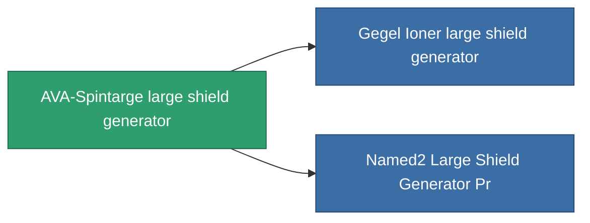

<!-- Generated by tools/generate from the live database (source: entitydefaults definition 729, aggregatevalues via aggregatefields).
     Do not edit by hand; regenerate instead. -->

# AVA-Spintarge large shield generator

|  |  |
|---|---|
| Definition | `def_named1_large_shield_generator` |
| Tier | 2 |
| Health | 100 |
| Volume | 1 |
| Mass | 720 |
| Category | Modules / Shield |

## Stats

| Field | Value |
|---|---|
| core_usage | 25 |
| cpu_usage | 300 |
| cycle_time | 9.5k |
| powergrid_usage | 1.125k |
| shield_absorbtion | 1.9048 |
| shield_radius | 30 |

<!-- production:generated -->
## Production

**Component of 2 items** — everything that uses it in production:

[All items](/content/items/)
