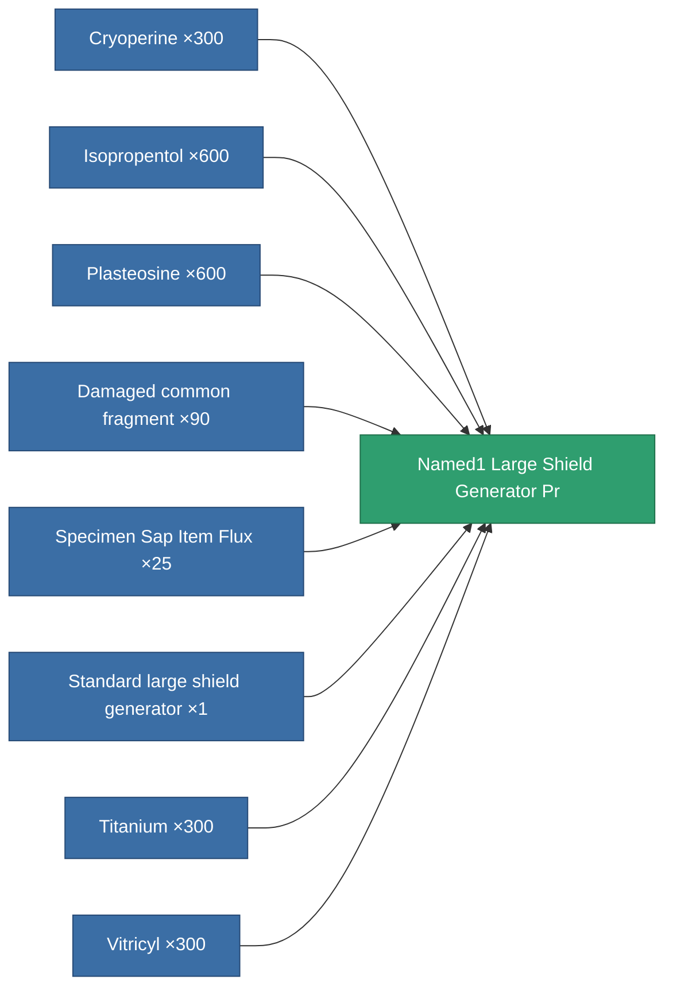

<!-- Generated by tools/generate from the live database (source: entitydefaults definition 5771, aggregatevalues via aggregatefields).
     Do not edit by hand; regenerate instead. -->

# Named1 Large Shield Generator Pr

|  |  |
|---|---|
| Definition | `def_named1_large_shield_generator_pr` |
| Tier | 2 |
| Health | 100 |
| Volume | 1 |
| Mass | 720 |
| Category | Modules / Shield |
| Note | large module |

## Stats

| Field | Value |
|---|---|
| core_usage | 25 |
| cpu_usage | 300 |
| cycle_time | 9.5k |
| powergrid_usage | 1.125k |
| shield_absorbtion | 1.9048 |
| shield_radius | 30 |

<!-- production:generated -->
## Production

**Produced from 8 components, research level 6** — assemble the components to build it (see [Recipes](/content/recipes/) for the full list):

[All items](/content/items/)
