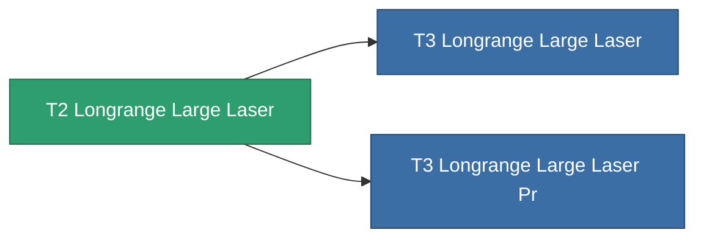

<!-- Generated by tools/generate from the live database (source: entitydefaults definition 1027, aggregatevalues via aggregatefields).
     Do not edit by hand; regenerate instead. -->

# T2 Longrange Large Laser

|  |  |
|---|---|
| Definition | `def_named1_longrange_large_laser` |
| Tier | T2 |
| Health | 100 |
| Volume | 1.5 |
| Mass | 1170 |
| Category | Modules / Weapons |
| Tier line | **T2 Longrange Large Laser** (T2) → [T3 Longrange Large Laser](/content/items/named2-longrange-large-laser/) (T3) → [T4 Longrange Large Laser](/content/items/named3-longrange-large-laser/) (T4) |

## Stats

| Field | Value |
|---|---|
| accuracy | 36 |
| core_usage | 12.32 |
| cpu_usage | 67.5 |
| cycle_time | 6k |
| damage_modifier | 1.5 |
| falloff | 25 |
| optimal_range | 44 |
| powergrid_usage | 367.5 |

<!-- production:generated -->
## Production

**Produced from 9 components** — assemble the components to build it (see [Recipes](/content/recipes/) for the full list):

<svg class="prod-card-icon" aria-hidden="true"><use href="#mi-grid"/></svg><a class="prod-card-name" href="/content/items/axicol/">Cryoperine</a>

required: <b>75</b>

<svg class="prod-card-icon" aria-hidden="true"><use href="#mi-grid"/></svg><a class="prod-card-name" href="/content/items/axicoline/">Axicoline</a>

required: <b>150</b>

<svg class="prod-card-icon" aria-hidden="true"><use href="#mi-robots"/></svg><a class="prod-card-name" href="/content/items/longrange-standard-large-laser/">Longrange Standard Large Laser</a>

required: <b>1</b>

<svg class="prod-card-icon" aria-hidden="true"><use href="#mi-grid"/></svg><a class="prod-card-name" href="/content/items/polynucleit/">Polynucleit</a>

required: <b>150</b>

<svg class="prod-card-icon" aria-hidden="true"><use href="#mi-grid"/></svg><a class="prod-card-name" href="/content/items/prilumium/">Prilumium</a>

required: <b>75</b>

<svg class="prod-card-icon" aria-hidden="true"><use href="#mi-crystal"/></svg><a class="prod-card-name" href="/content/items/robotshard-common-basic/">Damaged common fragment</a>

required: <b>45</b>

<svg class="prod-card-icon" aria-hidden="true"><use href="#mi-crystal"/></svg><a class="prod-card-name" href="/content/items/robotshard-thelodica-basic/">Damaged thelodica fragment</a>

required: <b>45</b>

<svg class="prod-card-icon" aria-hidden="true"><use href="#mi-grid"/></svg><a class="prod-card-name" href="/content/items/specimen-sap-item-flux/">Specimen Sap Item Flux</a>

required: <b>10</b>

<svg class="prod-card-icon" aria-hidden="true"><use href="#mi-grid"/></svg><a class="prod-card-name" href="/content/items/titanium/">Titanium</a>

required: <b>150</b>

## Used in production

**Component of 2 items** — everything that uses it in production:

