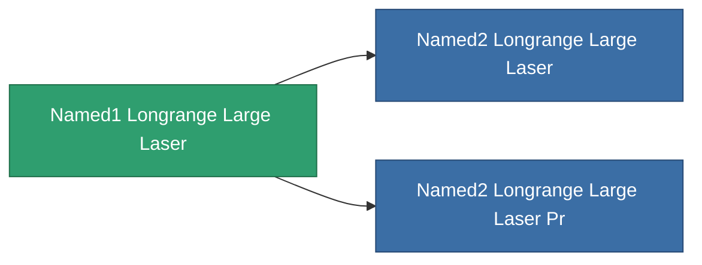

<!-- Generated by tools/generate from the live database (source: entitydefaults definition 1027, aggregatevalues via aggregatefields).
     Do not edit by hand; regenerate instead. -->

# Named1 Longrange Large Laser

|  |  |
|---|---|
| Definition | `def_named1_longrange_large_laser` |
| Tier | 2 |
| Health | 100 |
| Volume | 1.5 |
| Mass | 1170 |
| Category | Modules / Weapons |

## Stats

| Field | Value |
|---|---|
| accuracy | 36 |
| core_usage | 12.32 |
| cpu_usage | 67.5 |
| cycle_time | 6k |
| damage_modifier | 1.5 |
| falloff | 25 |
| optimal_range | 44 |
| powergrid_usage | 367.5 |

<!-- production:generated -->
## Production

**Component of 2 items** — everything that uses it in production:

[All items](/content/items/)
