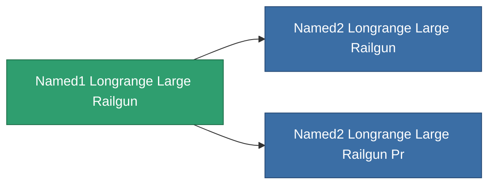

<!-- Generated by tools/generate from the live database (source: entitydefaults definition 1021, aggregatevalues via aggregatefields).
     Do not edit by hand; regenerate instead. -->

# Named1 Longrange Large Railgun

|  |  |
|---|---|
| Definition | `def_named1_longrange_large_railgun` |
| Tier | 2 |
| Health | 100 |
| Volume | 1.5 |
| Mass | 1170 |
| Category | Modules / Weapons |

## Stats

| Field | Value |
|---|---|
| accuracy | 42 |
| core_usage | 17.5 |
| cpu_usage | 90 |
| cycle_time | 10k |
| damage_modifier | 3 |
| falloff | 25.5 |
| optimal_range | 46 |
| powergrid_usage | 277.5 |

<!-- production:generated -->
## Production

**Component of 2 items** — everything that uses it in production:

[All items](/content/items/)
