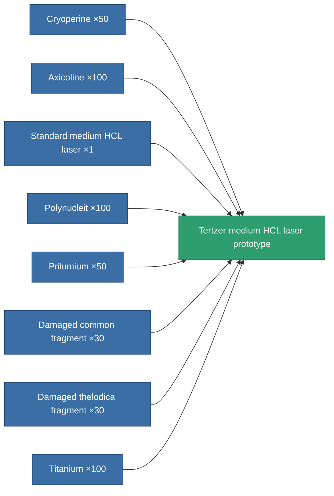

<!-- Generated by tools/generate from the live database (source: entitydefaults definition 2339, aggregatevalues via aggregatefields).
     Do not edit by hand; regenerate instead. -->

# Tertzer medium HCL laser prototype

|  |  |
|---|---|
| Definition | `def_named1_longrange_medium_laser_pr` |
| Tier | T2 (prototype) |
| Health | 100 |
| Volume | 1 |
| Mass | 585 |
| Category | Modules / Weapons |
| Tier line | [Tertzer medium HCL laser](/content/items/named1-longrange-medium-laser/) (T2) → **Tertzer medium HCL laser prototype** (T2) → [Thelotec-Iocle I. medium HCL laser](/content/items/named2-longrange-medium-laser/) (T3) → [Phisker 30PW medium HCL laser](/content/items/named3-longrange-medium-laser/) (T4) |

## Stats

| Field | Value |
|---|---|
| accuracy | 12 |
| core_usage | 16 |
| cpu_usage | 26 |
| cycle_time | 6k |
| damage_modifier | 1 |
| falloff | 10 |
| least_optimal | 11 |
| optimal_range | 35 |
| powergrid_usage | 200 |

<!-- production:generated -->
## Production

**Produced from 8 components, research level 5** — assemble the components to build it (see [Recipes](/content/recipes/) for the full list):

[All items](/content/items/)
