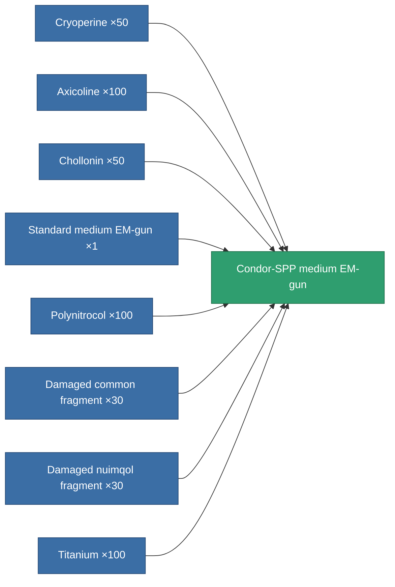
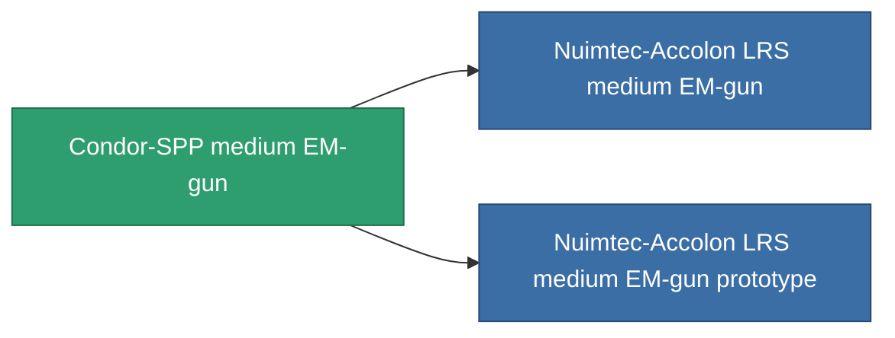

<!-- Generated by tools/generate from the live database (source: entitydefaults definition 1018, aggregatevalues via aggregatefields).
     Do not edit by hand; regenerate instead. -->

# Condor-SPP medium EM-gun

|  |  |
|---|---|
| Definition | `def_named1_longrange_medium_railgun` |
| Tier | T2 |
| Health | 100 |
| Volume | 1 |
| Mass | 585 |
| Category | Modules / Weapons |
| Tier line | **Condor-SPP medium EM-gun** (T2) → [Nuimtec-Accolon LRS medium EM-gun](/content/items/named2-longrange-medium-railgun/) (T3) → [5.5-Glipler medium EM-gun](/content/items/named3-longrange-medium-railgun/) (T4) |

## Stats

| Field | Value |
|---|---|
| accuracy | 14 |
| core_usage | 20 |
| cpu_usage | 36 |
| cycle_time | 10k |
| damage_modifier | 2 |
| falloff | 7.5 |
| least_optimal | 21 |
| optimal_range | 29 |
| powergrid_usage | 170 |

<!-- production:generated -->
## Production

**Produced from 8 components, research level 5** — assemble the components to build it (see [Recipes](/content/recipes/) for the full list):

## Used in production

**Component of 2 items** — everything that uses it in production:

[All items](/content/items/)
