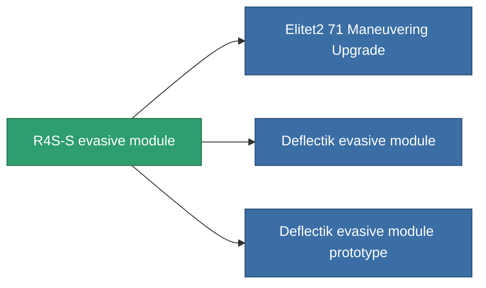

<!-- Generated by tools/generate from the live database (source: entitydefaults definition 2565, aggregatevalues via aggregatefields).
     Do not edit by hand; regenerate instead. -->

# R4S-S evasive module

|  |  |
|---|---|
| Definition | `def_named1_maneuvering_upgrade` |
| Tier | 2 |
| Health | 100 |
| Volume | 0.5 |
| Mass | 20 |
| Category | Modules / Enhancements |

## Stats

| Field | Value |
|---|---|
| cpu_usage | 21 |
| massiveness | 0.05 |
| powergrid_usage | 22 |
| signature_radius | -0.85 |

<!-- production:generated -->
## Production

**Component of 3 items** — everything that uses it in production:

[All items](/content/items/)
