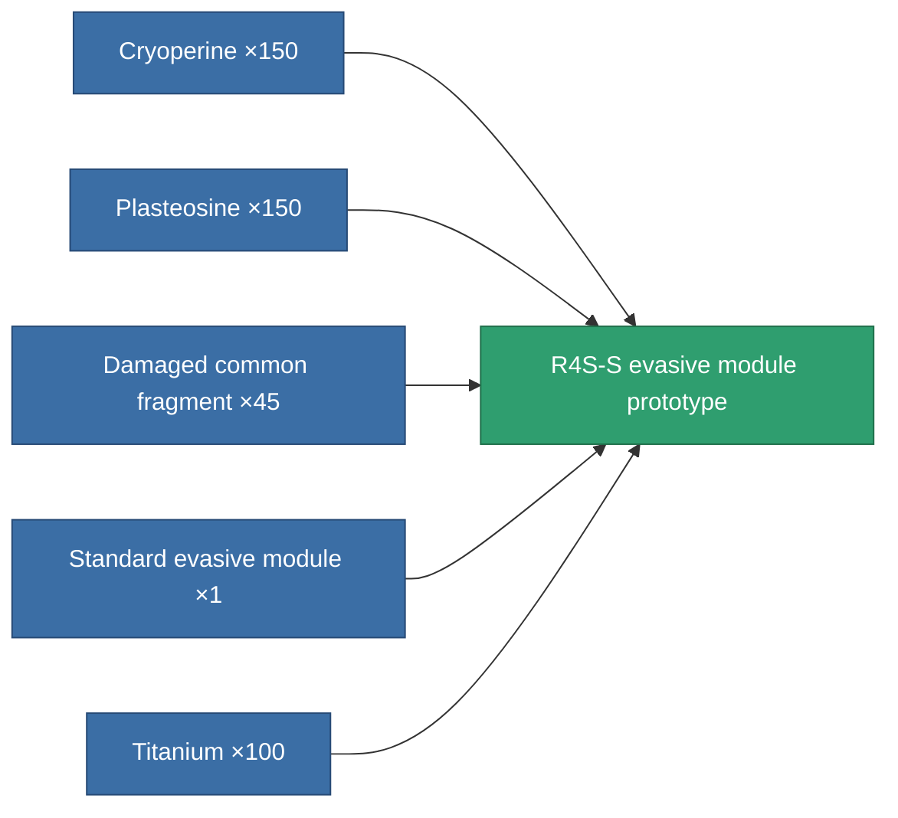

<!-- Generated by tools/generate from the live database (source: entitydefaults definition 2613, aggregatevalues via aggregatefields).
     Do not edit by hand; regenerate instead. -->

# R4S-S evasive module prototype

|  |  |
|---|---|
| Definition | `def_named1_maneuvering_upgrade_pr` |
| Tier | T2 (prototype) |
| Health | 100 |
| Volume | 0.5 |
| Mass | 17 |
| Category | Modules / Enhancements |
| Tier line | [Standard evasive module](/content/items/standard-maneuvering-upgrade/) (T1) → [R4S-S evasive module](/content/items/named1-maneuvering-upgrade/) (T2) → **R4S-S evasive module prototype** (T2) → [Deflectik evasive module](/content/items/named2-maneuvering-upgrade/) (T3) → [Yridan RCD evasive module](/content/items/named3-maneuvering-upgrade/) (T4) |

## Stats

| Field | Value |
|---|---|
| cpu_usage | 19 |
| massiveness | 0.05 |
| powergrid_usage | 21 |
| signature_radius | -0.88 |

<!-- production:generated -->
## Production

**Produced from 5 components, research level 6** — assemble the components to build it (see [Recipes](/content/recipes/) for the full list):

[All items](/content/items/)
