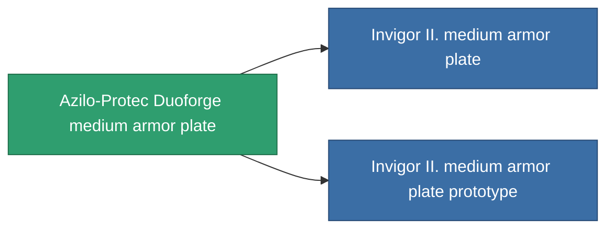

<!-- Generated by tools/generate from the live database (source: entitydefaults definition 687, aggregatevalues via aggregatefields).
     Do not edit by hand; regenerate instead. -->

# Azilo-Protec Duoforge medium armor plate

|  |  |
|---|---|
| Definition | `def_named1_medium_armor_plate` |
| Tier | 2 |
| Health | 100 |
| Volume | 2 |
| Mass | 2400 |
| Category | Modules / Armor |

## Stats

| Field | Value |
|---|---|
| armor_max | 1.35k |
| cpu_usage | 2 |
| massiveness | 0.12 |
| powergrid_usage | 60 |
| signature_radius | 1 |

<!-- production:generated -->
## Production

**Component of 2 items** — everything that uses it in production:

[All items](/content/items/)
