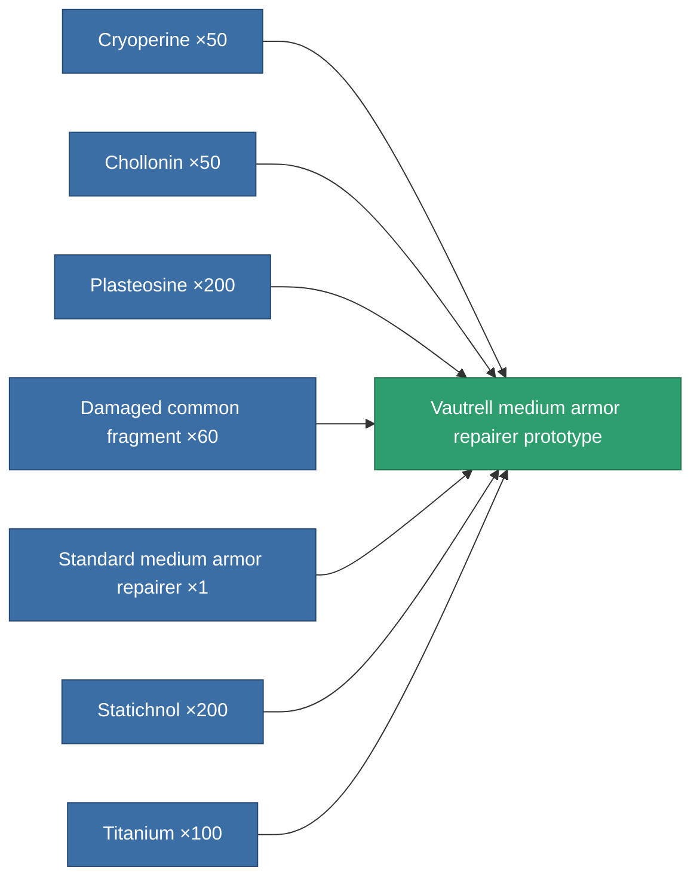

<!-- Generated by tools/generate from the live database (source: entitydefaults definition 2183, aggregatevalues via aggregatefields).
     Do not edit by hand; regenerate instead. -->

# Vautrell medium armor repairer prototype

|  |  |
|---|---|
| Definition | `def_named1_medium_armor_repairer_pr` |
| Tier | 2 |
| Health | 100 |
| Volume | 1.5 |
| Mass | 506.25 |
| Category | Modules / Repair |

## Stats

| Field | Value |
|---|---|
| armor_repair_amount | 180 |
| core_usage | 278 |
| cpu_usage | 43 |
| cycle_time | 15k |
| powergrid_usage | 86 |

<!-- production:generated -->
## Production

**Produced from 7 components, research level 5** — assemble the components to build it (see [Recipes](/content/recipes/) for the full list):

[All items](/content/items/)
