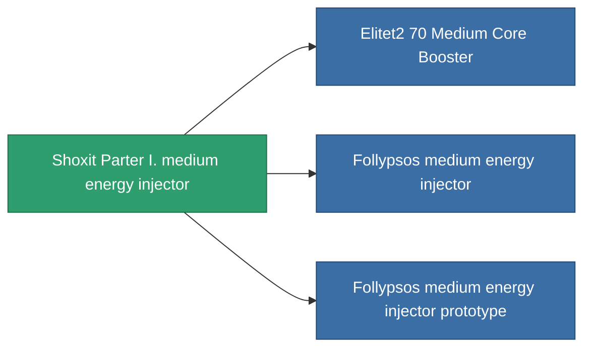

<!-- Generated by tools/generate from the live database (source: entitydefaults definition 825, aggregatevalues via aggregatefields).
     Do not edit by hand; regenerate instead. -->

# Shoxit Parter I. medium energy injector

|  |  |
|---|---|
| Definition | `def_named1_medium_core_booster` |
| Tier | T2 |
| Health | 100 |
| Volume | 1 |
| Mass | 180 |
| Category | Modules / Enhancements |
| Tier line | [Standard medium energy injector](/content/items/standard-medium-core-booster/) (T1) → **Shoxit Parter I. medium energy injector** (T2) → [Follypsos medium energy injector](/content/items/named2-medium-core-booster/) (T3) → [Cerepter II. medium energy injector](/content/items/named3-medium-core-booster/) (T4) |

## Stats

| Field | Value |
|---|---|
| core_usage | 0 |
| cpu_usage | 23 |
| cycle_time | 11k |
| powergrid_usage | 225 |

<!-- production:generated -->
## Production

**Produced from 4 components, research level 5** — assemble the components to build it (see [Recipes](/content/recipes/) for the full list):

<svg class="prod-card-icon" aria-hidden="true"><use href="#mi-grid"/></svg><a class="prod-card-name" href="/content/items/axicol/">Cryoperine</a>

required: <b>200</b>

<svg class="prod-card-icon" aria-hidden="true"><use href="#mi-crystal"/></svg><a class="prod-card-name" href="/content/items/robotshard-common-basic/">Damaged common fragment</a>

required: <b>60</b>

<svg class="prod-card-icon" aria-hidden="true"><use href="#mi-grid"/></svg><a class="prod-card-name" href="/content/items/standard-medium-core-booster/">Standard medium energy injector</a>

required: <b>1</b>

<svg class="prod-card-icon" aria-hidden="true"><use href="#mi-grid"/></svg><a class="prod-card-name" href="/content/items/titanium/">Titanium</a>

required: <b>200</b>

## Used in production

**Component of 3 items** — everything that uses it in production:

