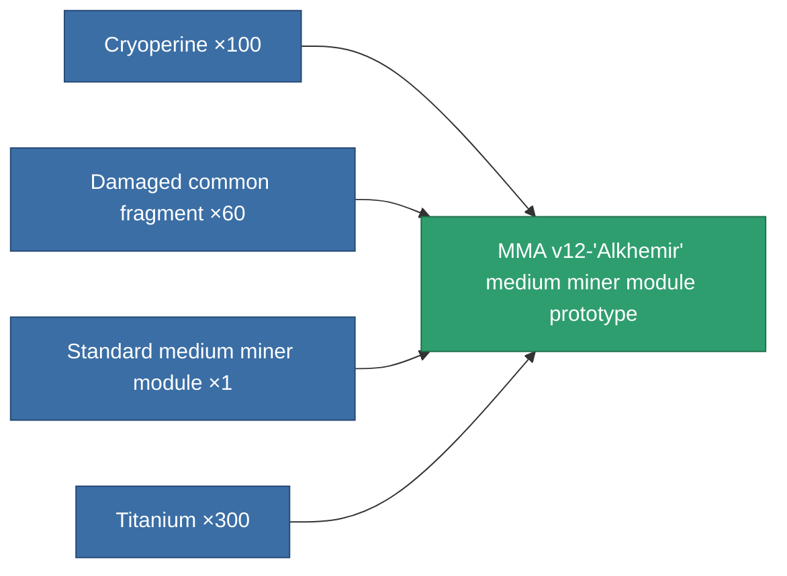

<!-- Generated by tools/generate from the live database (source: entitydefaults definition 2270, aggregatevalues via aggregatefields).
     Do not edit by hand; regenerate instead. -->

# MMA v12-'Alkhemir' medium miner module prototype

|  |  |
|---|---|
| Definition | `def_named1_medium_driller_pr` |
| Tier | 2 |
| Health | 100 |
| Volume | 1.5 |
| Mass | 675 |
| Category | Modules / Enhancements |

## Stats

| Field | Value |
|---|---|
| core_usage | 65 |
| cpu_usage | 46 |
| cycle_time | 12k |
| optimal_range | 3 |
| powergrid_usage | 128 |

<!-- production:generated -->
## Production

**Produced from 4 components, research level 4** — assemble the components to build it (see [Recipes](/content/recipes/) for the full list):

[All items](/content/items/)
