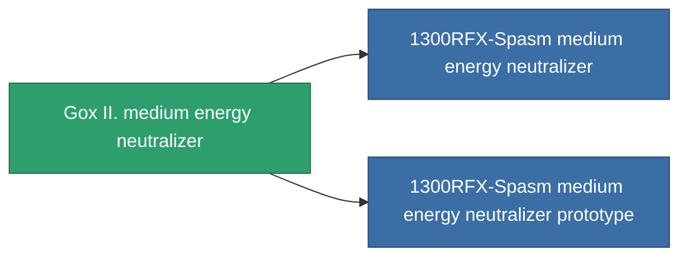

<!-- Generated by tools/generate from the live database (source: entitydefaults definition 756, aggregatevalues via aggregatefields).
     Do not edit by hand; regenerate instead. -->

# Gox II. medium energy neutralizer

|  |  |
|---|---|
| Definition | `def_named1_medium_energy_neutralizer` |
| Tier | 2 |
| Health | 100 |
| Volume | 1 |
| Mass | 470 |
| Category | Modules / Shield |

## Stats

| Field | Value |
|---|---|
| core_usage | 215 |
| cpu_usage | 33 |
| cycle_time | 10k |
| energy_dispersion | 10 |
| energy_neutralized_amount | 250 |
| falloff | 0 |
| optimal_range | 25 |
| powergrid_usage | 190 |

<!-- production:generated -->
## Production

**Component of 2 items** — everything that uses it in production:

[All items](/content/items/)
