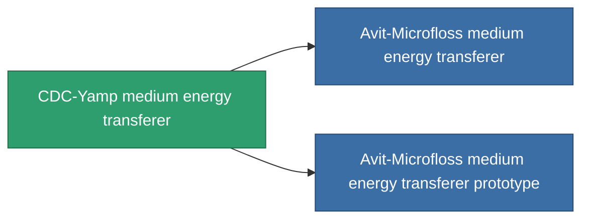

<!-- Generated by tools/generate from the live database (source: entitydefaults definition 738, aggregatevalues via aggregatefields).
     Do not edit by hand; regenerate instead. -->

# CDC-Yamp medium energy transferer

|  |  |
|---|---|
| Definition | `def_named1_medium_energy_transfer` |
| Tier | T2 |
| Health | 100 |
| Volume | 1 |
| Mass | 450 |
| Category | Modules / Enhancements |
| Tier line | [Standard medium energy transferer](/content/items/standard-medium-energy-transfer/) (T1) → **CDC-Yamp medium energy transferer** (T2) → [Avit-Microfloss medium energy transferer](/content/items/named2-medium-energy-transfer/) (T3) → [Livostid PT-VI medium energy transferer](/content/items/named3-medium-energy-transfer/) (T4) |

## Stats

| Field | Value |
|---|---|
| core_usage | 50 |
| cpu_usage | 43 |
| cycle_time | 10k |
| energy_transfer_amount | 200 |
| falloff | 0 |
| optimal_range | 30 |
| powergrid_usage | 140 |

<!-- production:generated -->
## Production

**Produced from 4 components, research level 5** — assemble the components to build it (see [Recipes](/content/recipes/) for the full list):

<svg class="prod-card-icon" aria-hidden="true"><use href="#mi-grid"/></svg><a class="prod-card-name" href="/content/items/axicol/">Cryoperine</a>

required: <b>500</b>

<svg class="prod-card-icon" aria-hidden="true"><use href="#mi-crystal"/></svg><a class="prod-card-name" href="/content/items/robotshard-common-basic/">Damaged common fragment</a>

required: <b>60</b>

<svg class="prod-card-icon" aria-hidden="true"><use href="#mi-grid"/></svg><a class="prod-card-name" href="/content/items/standard-medium-energy-transfer/">Standard medium energy transferer</a>

required: <b>1</b>

<svg class="prod-card-icon" aria-hidden="true"><use href="#mi-grid"/></svg><a class="prod-card-name" href="/content/items/titanium/">Titanium</a>

required: <b>200</b>

## Used in production

**Component of 2 items** — everything that uses it in production:

