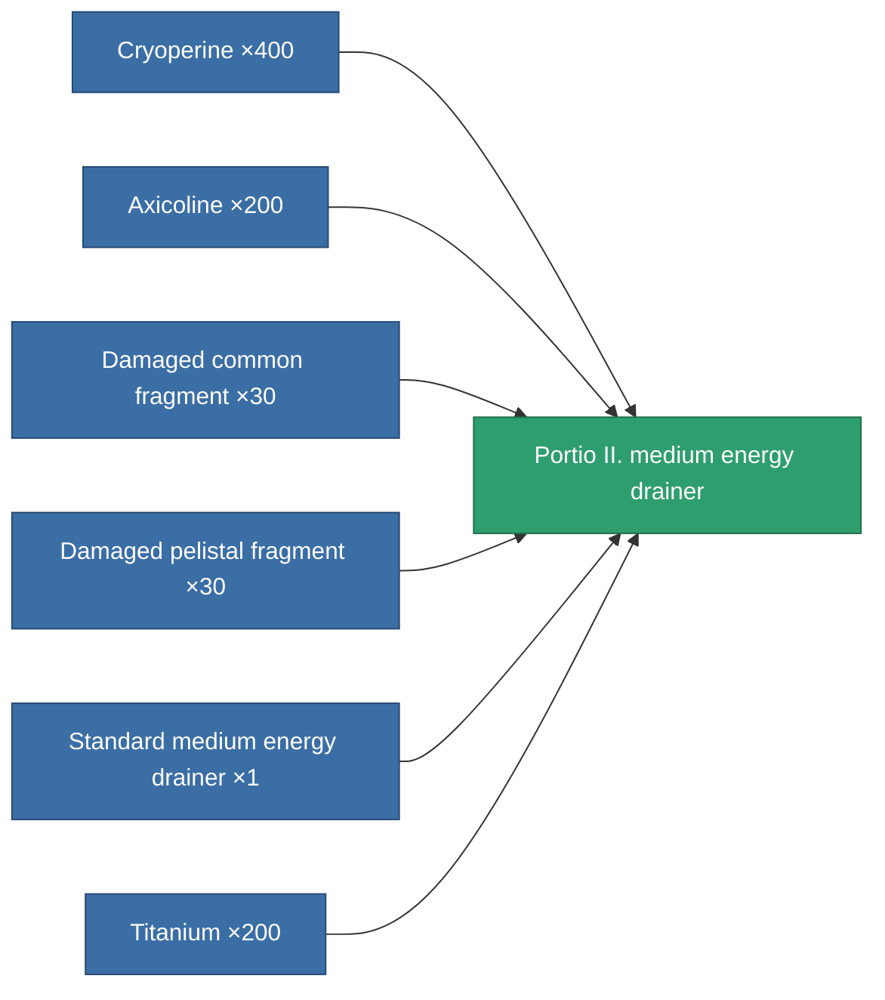
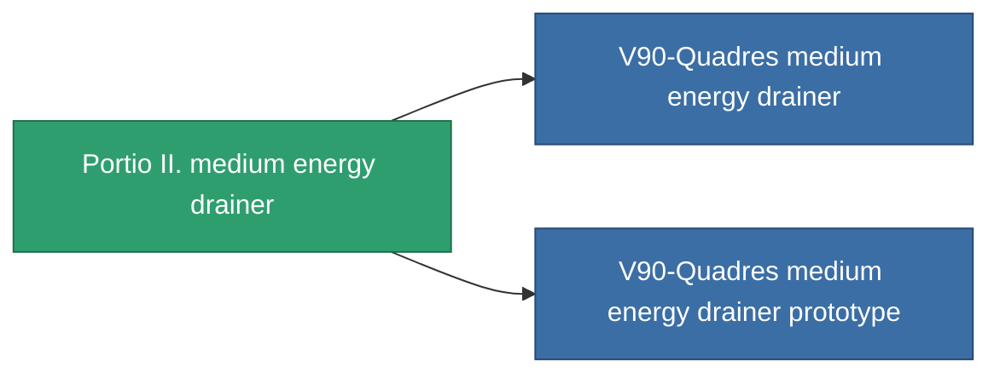

<!-- Generated by tools/generate from the live database (source: entitydefaults definition 747, aggregatevalues via aggregatefields).
     Do not edit by hand; regenerate instead. -->

# Portio II. medium energy drainer

|  |  |
|---|---|
| Definition | `def_named1_medium_energy_vampire` |
| Tier | 2 |
| Health | 100 |
| Volume | 1 |
| Mass | 470 |
| Category | Modules / Shield |

## Stats

| Field | Value |
|---|---|
| core_usage | 15 |
| cpu_usage | 53 |
| cycle_time | 10k |
| energy_dispersion | 10 |
| energy_vampired_amount | 90 |
| falloff | 0 |
| optimal_range | 25 |
| powergrid_usage | 165 |

<!-- production:generated -->
## Production

**Produced from 6 components, research level 5** — assemble the components to build it (see [Recipes](/content/recipes/) for the full list):

## Used in production

**Component of 2 items** — everything that uses it in production:

[All items](/content/items/)
