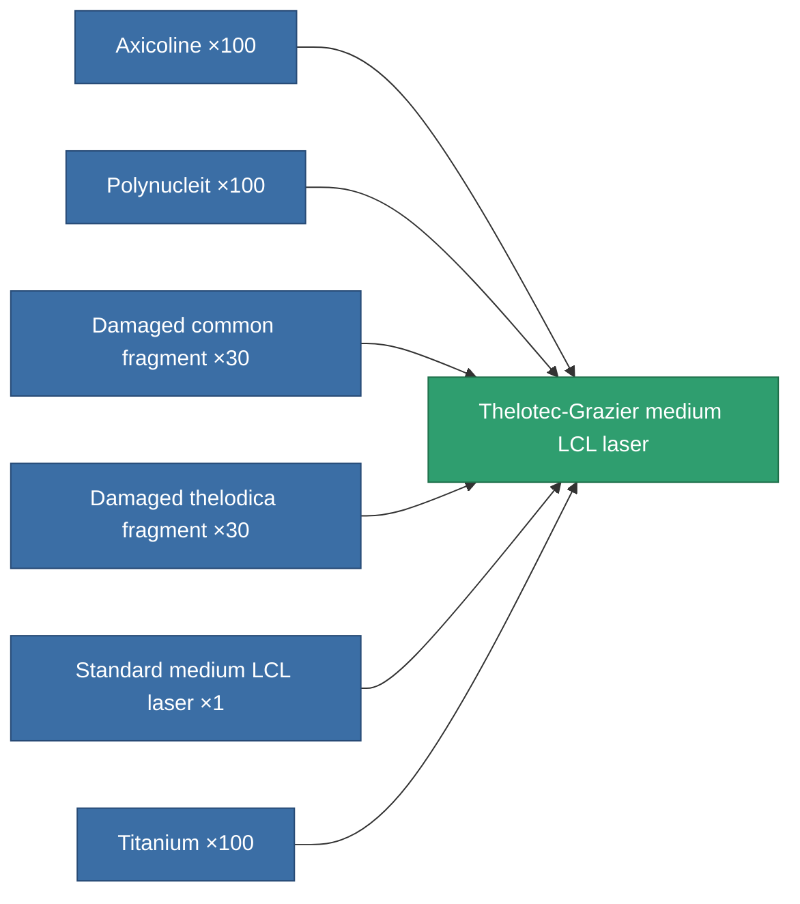
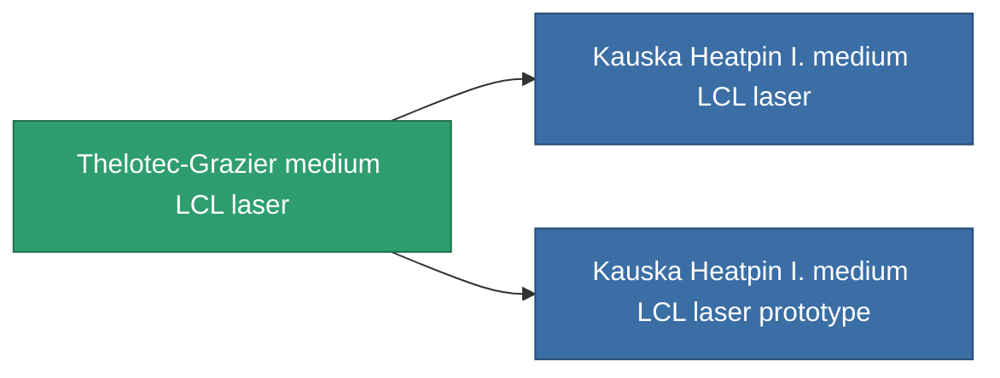

<!-- Generated by tools/generate from the live database (source: entitydefaults definition 834, aggregatevalues via aggregatefields).
     Do not edit by hand; regenerate instead. -->

# Thelotec-Grazier medium LCL laser

|  |  |
|---|---|
| Definition | `def_named1_medium_laser` |
| Tier | T2 |
| Health | 100 |
| Volume | 1 |
| Mass | 450 |
| Category | Modules / Weapons |
| Tier line | [Standard medium LCL laser](/content/items/standard-medium-laser/) (T1) → **Thelotec-Grazier medium LCL laser** (T2) → [Kauska Heatpin I. medium LCL laser](/content/items/named2-medium-laser/) (T3) → [Thermodissector medium LCL laser](/content/items/named3-medium-laser/) (T4) |

## Stats

| Field | Value |
|---|---|
| accuracy | 11.5 |
| core_usage | 13.6 |
| cpu_usage | 22 |
| cycle_time | 5k |
| damage_modifier | 1.275 |
| falloff | 10 |
| least_optimal | 5 |
| optimal_range | 17.5 |
| powergrid_usage | 180 |

<!-- production:generated -->
## Production

**Produced from 6 components, research level 5** — assemble the components to build it (see [Recipes](/content/recipes/) for the full list):

## Used in production

**Component of 2 items** — everything that uses it in production:

[All items](/content/items/)
