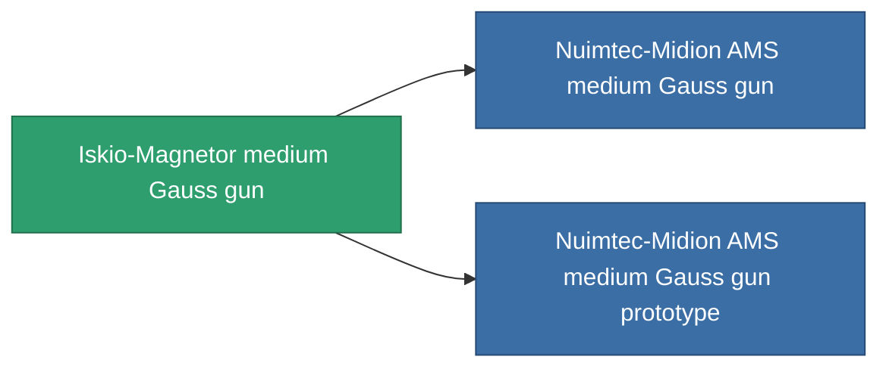

<!-- Generated by tools/generate from the live database (source: entitydefaults definition 861, aggregatevalues via aggregatefields).
     Do not edit by hand; regenerate instead. -->

# Iskio-Magnetor medium Gauss gun

|  |  |
|---|---|
| Definition | `def_named1_medium_railgun` |
| Tier | T2 |
| Health | 100 |
| Volume | 1 |
| Mass | 450 |
| Category | Modules / Weapons |
| Tier line | [Standard medium Gauss gun](/content/items/standard-medium-railgun/) (T1) → **Iskio-Magnetor medium Gauss gun** (T2) → [Nuimtec-Midion AMS medium Gauss gun](/content/items/named2-medium-railgun/) (T3) → [Prompt medium Gauss gun](/content/items/named3-medium-railgun/) (T4) |

## Stats

| Field | Value |
|---|---|
| accuracy | 13.5 |
| core_usage | 12 |
| cpu_usage | 29 |
| cycle_time | 6k |
| damage_modifier | 1.7 |
| falloff | 7.5 |
| least_optimal | 12 |
| optimal_range | 15 |
| powergrid_usage | 135 |

<!-- production:generated -->
## Production

**Produced from 6 components, research level 5** — assemble the components to build it (see [Recipes](/content/recipes/) for the full list):

<svg class="prod-card-icon" aria-hidden="true"><use href="#mi-grid"/></svg><a class="prod-card-name" href="/content/items/axicoline/">Axicoline</a>

required: <b>100</b>

<svg class="prod-card-icon" aria-hidden="true"><use href="#mi-grid"/></svg><a class="prod-card-name" href="/content/items/polynitrocol/">Polynitrocol</a>

required: <b>100</b>

<svg class="prod-card-icon" aria-hidden="true"><use href="#mi-crystal"/></svg><a class="prod-card-name" href="/content/items/robotshard-common-basic/">Damaged common fragment</a>

required: <b>30</b>

<svg class="prod-card-icon" aria-hidden="true"><use href="#mi-crystal"/></svg><a class="prod-card-name" href="/content/items/robotshard-nuimqol-basic/">Damaged nuimqol fragment</a>

required: <b>30</b>

<svg class="prod-card-icon" aria-hidden="true"><use href="#mi-grid"/></svg><a class="prod-card-name" href="/content/items/standard-medium-railgun/">Standard medium Gauss gun</a>

required: <b>1</b>

<svg class="prod-card-icon" aria-hidden="true"><use href="#mi-grid"/></svg><a class="prod-card-name" href="/content/items/titanium/">Titanium</a>

required: <b>100</b>

## Used in production

**Component of 2 items** — everything that uses it in production:

