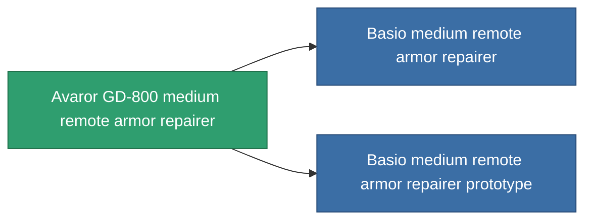

<!-- Generated by tools/generate from the live database (source: entitydefaults definition 705, aggregatevalues via aggregatefields).
     Do not edit by hand; regenerate instead. -->

# Avaror GD-800 medium remote armor repairer

|  |  |
|---|---|
| Definition | `def_named1_medium_remote_armor_repairer` |
| Tier | 2 |
| Health | 100 |
| Volume | 1.5 |
| Mass | 450 |
| Category | Modules / Repair |

## Stats

| Field | Value |
|---|---|
| armor_repair_amount | 180 |
| core_usage | 340 |
| cpu_usage | 55 |
| cycle_time | 20k |
| falloff | 0 |
| optimal_range | 20 |
| powergrid_usage | 110 |

<!-- production:generated -->
## Production

**Component of 2 items** — everything that uses it in production:

[All items](/content/items/)
