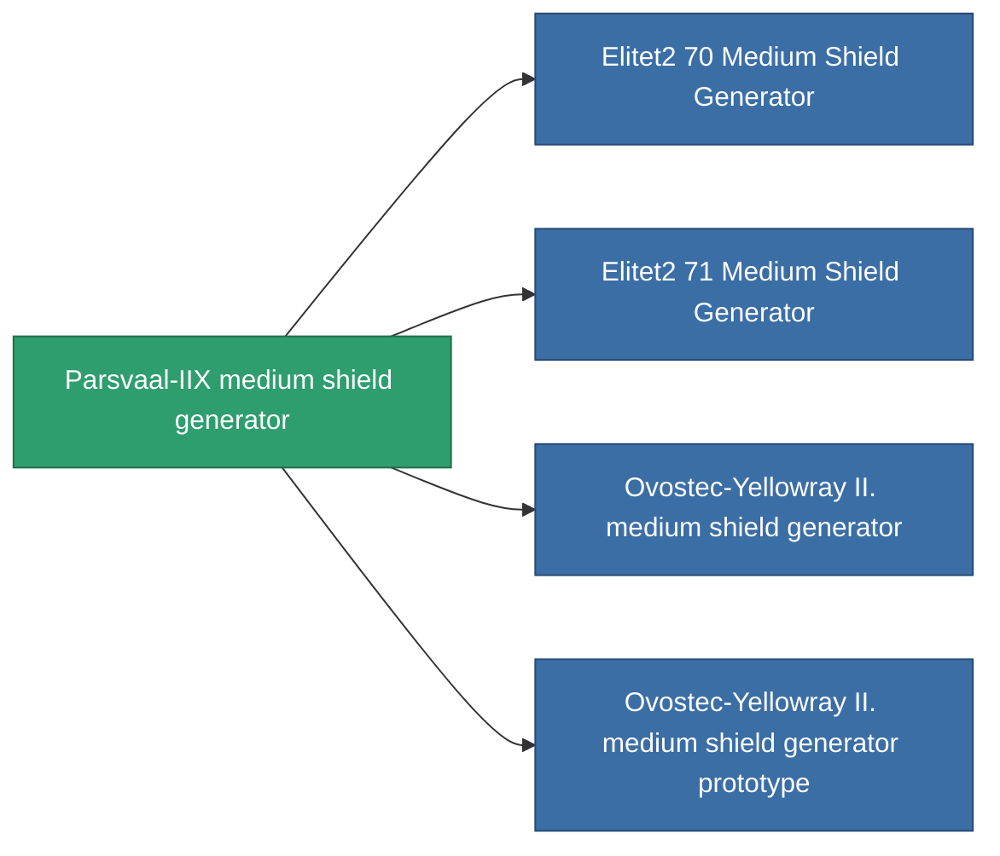

<!-- Generated by tools/generate from the live database (source: entitydefaults definition 726, aggregatevalues via aggregatefields).
     Do not edit by hand; regenerate instead. -->

# Parsvaal-IIX medium shield generator

|  |  |
|---|---|
| Definition | `def_named1_medium_shield_generator` |
| Tier | 2 |
| Health | 100 |
| Volume | 0.5 |
| Mass | 360 |
| Category | Modules / Shield |

## Stats

| Field | Value |
|---|---|
| core_usage | 12.5 |
| cpu_usage | 60 |
| cycle_time | 9.5k |
| powergrid_usage | 225 |
| shield_absorbtion | 2 |
| shield_radius | 12 |

<!-- production:generated -->
## Production

**Component of 4 items** — everything that uses it in production:

[All items](/content/items/)
