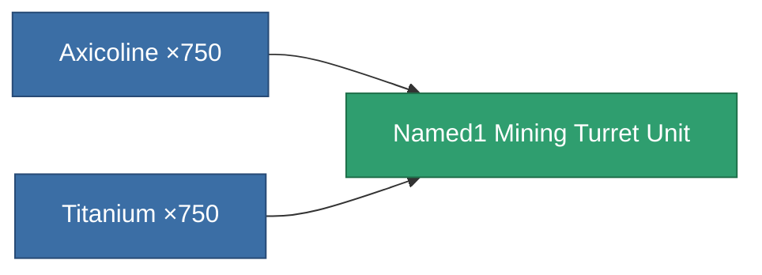

<!-- Generated by tools/generate from the live database (source: entitydefaults definition 8362, aggregatevalues via aggregatefields).
     Do not edit by hand; regenerate instead. -->

# Named1 Mining Turret Unit

|  |  |
|---|---|
| Definition | `def_named1_mining_turret_unit` |
| Tier | 2 |
| Health | 100 |
| Volume | 10 |
| Mass | 1 |
| Category | Special & other / Miscellaneous |

## Stats

| Field | Value |
|---|---|
| cycle_time | 5.56k |
| mining_amount_modifier | 3.7268 |
| remote_control_bandwidth_usage | 4 |
| remote_control_lifetime | 300k |

<!-- production:generated -->
## Production

**Produced from 2 components, research level 3** — assemble the components to build it (see [Recipes](/content/recipes/) for the full list):

[All items](/content/items/)
