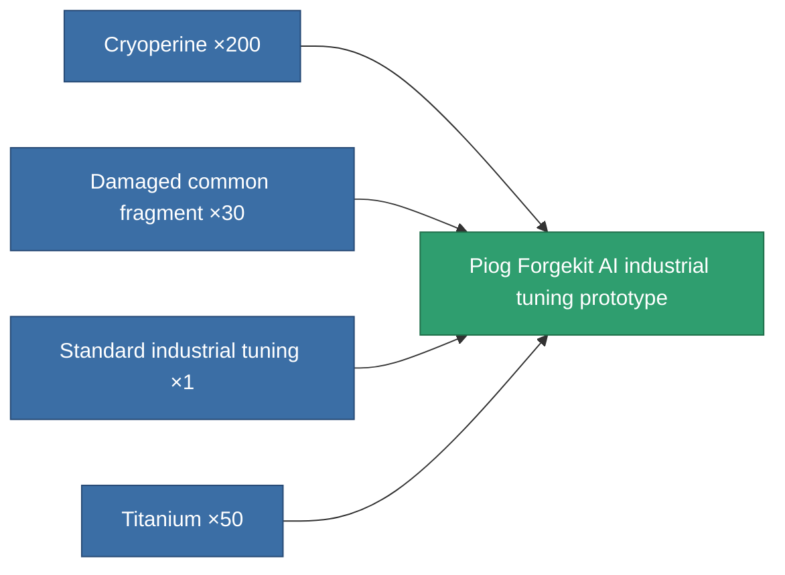

<!-- Generated by tools/generate from the live database (source: entitydefaults definition 2273, aggregatevalues via aggregatefields).
     Do not edit by hand; regenerate instead. -->

# Piog Forgekit AI industrial tuning prototype

|  |  |
|---|---|
| Definition | `def_named1_mining_upgrade_pr` |
| Tier | T2 (prototype) |
| Health | 100 |
| Volume | 0.1 |
| Mass | 45 |
| Category | Modules / Enhancements |
| Tier line | [Standard industrial tuning](/content/items/standard-mining-upgrade/) (T1) → [Piog Forgekit AI industrial tuning](/content/items/named1-mining-upgrade/) (T2) → **Piog Forgekit AI industrial tuning prototype** (T2) → [Fraktura SCV industrial tuning](/content/items/named2-mining-upgrade/) (T3) → [Piog Forgekit BW1 industrial tuning](/content/items/named3-mining-upgrade/) (T4) |

## Stats

| Field | Value |
|---|---|
| cpu_usage | 28 |
| harvesting_amount_modifier | 1.05 |
| mining_amount_modifier | 1.05 |
| powergrid_usage | 17 |

<!-- production:generated -->
## Production

**Produced from 4 components, research level 4** — assemble the components to build it (see [Recipes](/content/recipes/) for the full list):

[All items](/content/items/)
