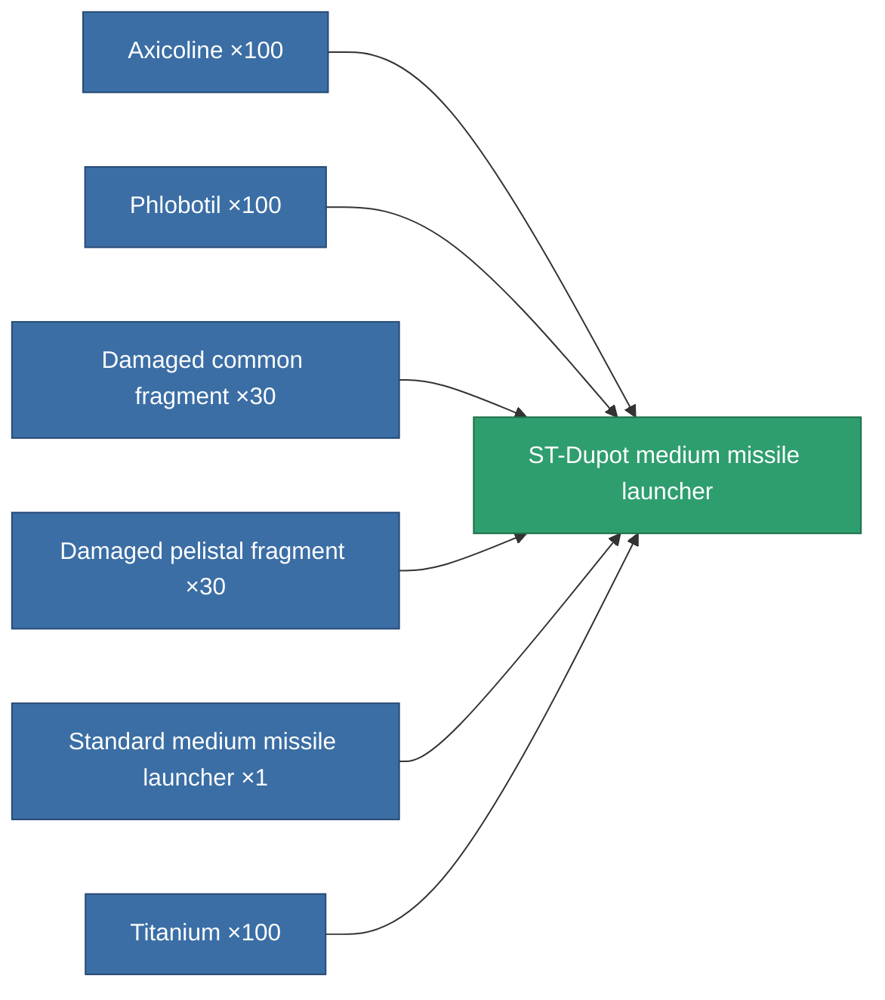
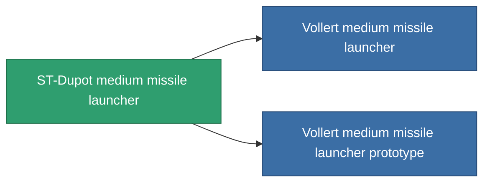

<!-- Generated by tools/generate from the live database (source: entitydefaults definition 852, aggregatevalues via aggregatefields).
     Do not edit by hand; regenerate instead. -->

# ST-Dupot medium missile launcher

|  |  |
|---|---|
| Definition | `def_named1_missile_launcher` |
| Tier | 2 |
| Health | 100 |
| Volume | 2 |
| Mass | 450 |
| Category | Modules / Weapons |

## Stats

| Field | Value |
|---|---|
| accuracy | 1 |
| core_usage | 2 |
| cpu_usage | 36 |
| cycle_time | 14k |
| damage_modifier | 1 |
| powergrid_usage | 135 |

<!-- production:generated -->
## Production

**Produced from 6 components, research level 5** — assemble the components to build it (see [Recipes](/content/recipes/) for the full list):

## Used in production

**Component of 2 items** — everything that uses it in production:

[All items](/content/items/)
