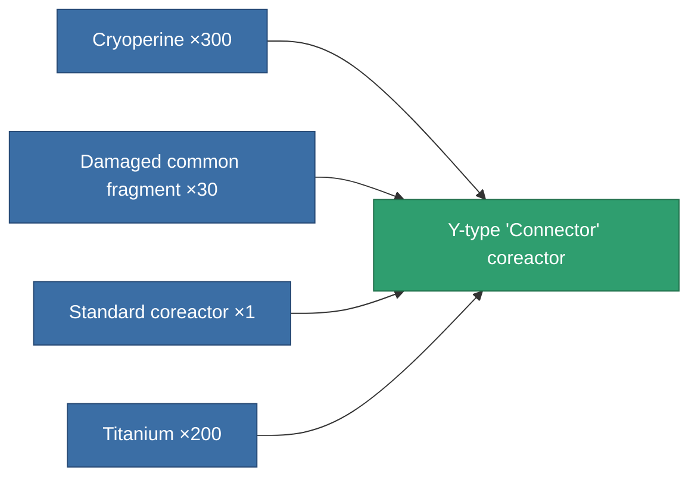
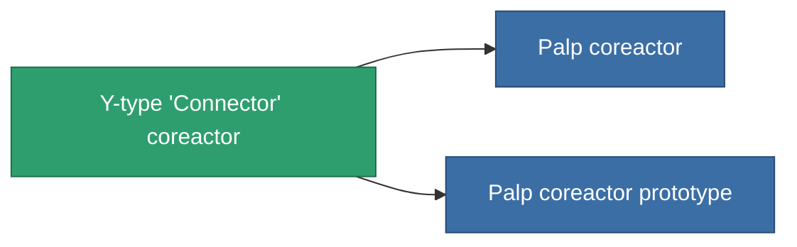

<!-- Generated by tools/generate from the live database (source: entitydefaults definition 765, aggregatevalues via aggregatefields).
     Do not edit by hand; regenerate instead. -->

# Y-type 'Connector' coreactor

|  |  |
|---|---|
| Definition | `def_named1_powergrid_upgrades` |
| Tier | T2 |
| Health | 100 |
| Volume | 0.5 |
| Mass | 90 |
| Category | Modules / Power |
| Tier line | [Standard coreactor](/content/items/standard-powergrid-upgrades/) (T1) → **Y-type 'Connector' coreactor** (T2) → [Palp coreactor](/content/items/named2-powergrid-upgrades/) (T3) → [E-set 15VaW coreactor](/content/items/named3-powergrid-upgrades/) (T4) |

## Stats

| Field | Value |
|---|---|
| cpu_usage | 30 |
| powergrid_max_modifier | 1.1 |

<!-- production:generated -->
## Production

**Produced from 4 components, research level 4** — assemble the components to build it (see [Recipes](/content/recipes/) for the full list):

## Used in production

**Component of 2 items** — everything that uses it in production:

[All items](/content/items/)
