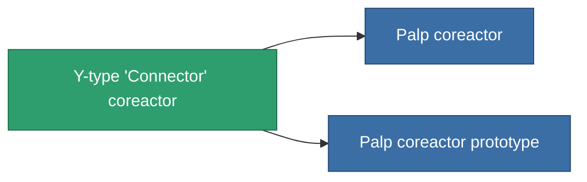

<!-- Generated by tools/generate from the live database (source: entitydefaults definition 765, aggregatevalues via aggregatefields).
     Do not edit by hand; regenerate instead. -->

# Y-type 'Connector' coreactor

|  |  |
|---|---|
| Definition | `def_named1_powergrid_upgrades` |
| Tier | 2 |
| Health | 100 |
| Volume | 0.5 |
| Mass | 90 |
| Category | Modules / Power |

## Stats

| Field | Value |
|---|---|
| cpu_usage | 30 |
| powergrid_max_modifier | 1.1 |

<!-- production:generated -->
## Production

**Component of 2 items** — everything that uses it in production:

[All items](/content/items/)
