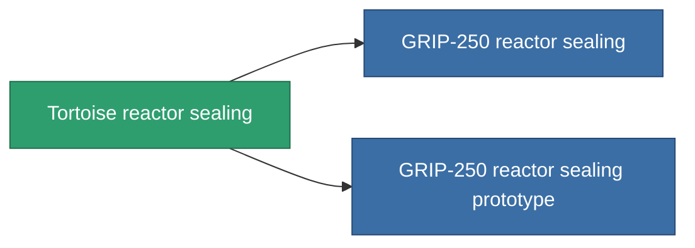

<!-- Generated by tools/generate from the live database (source: entitydefaults definition 4580, aggregatevalues via aggregatefields).
     Do not edit by hand; regenerate instead. -->

# Tortoise reactor sealing

|  |  |
|---|---|
| Definition | `def_named1_reactor_sealing` |
| Tier | T2 |
| Health | 100 |
| Volume | 1 |
| Mass | 135 |
| Category | Modules / Enhancements |
| Tier line | [Standard reactor sealing](/content/items/standard-reactor-sealing/) (T1) → **Tortoise reactor sealing** (T2) → [GRIP-250 reactor sealing](/content/items/named2-reactor-sealing/) (T3) → [GRIP-500p reactor sealing](/content/items/named3-reactor-sealing/) (T4) |

## Stats

| Field | Value |
|---|---|
| cpu_usage | 13 |
| powergrid_usage | 68 |
| reactor_radiation_modifier | 0.75 |

<!-- production:generated -->
## Production

**Produced from 5 components, research level 4** — assemble the components to build it (see [Recipes](/content/recipes/) for the full list):

<svg class="prod-card-icon" aria-hidden="true"><use href="#mi-grid"/></svg><a class="prod-card-name" href="/content/items/axicol/">Cryoperine</a>

required: <b>150</b>

<svg class="prod-card-icon" aria-hidden="true"><use href="#mi-grid"/></svg><a class="prod-card-name" href="/content/items/plasteosine/">Plasteosine</a>

required: <b>250</b>

<svg class="prod-card-icon" aria-hidden="true"><use href="#mi-crystal"/></svg><a class="prod-card-name" href="/content/items/robotshard-common-basic/">Damaged common fragment</a>

required: <b>30</b>

<svg class="prod-card-icon" aria-hidden="true"><use href="#mi-grid"/></svg><a class="prod-card-name" href="/content/items/standard-reactor-sealing/">Standard reactor sealing</a>

required: <b>1</b>

<svg class="prod-card-icon" aria-hidden="true"><use href="#mi-grid"/></svg><a class="prod-card-name" href="/content/items/titanium/">Titanium</a>

required: <b>100</b>

## Used in production

**Component of 2 items** — everything that uses it in production:

