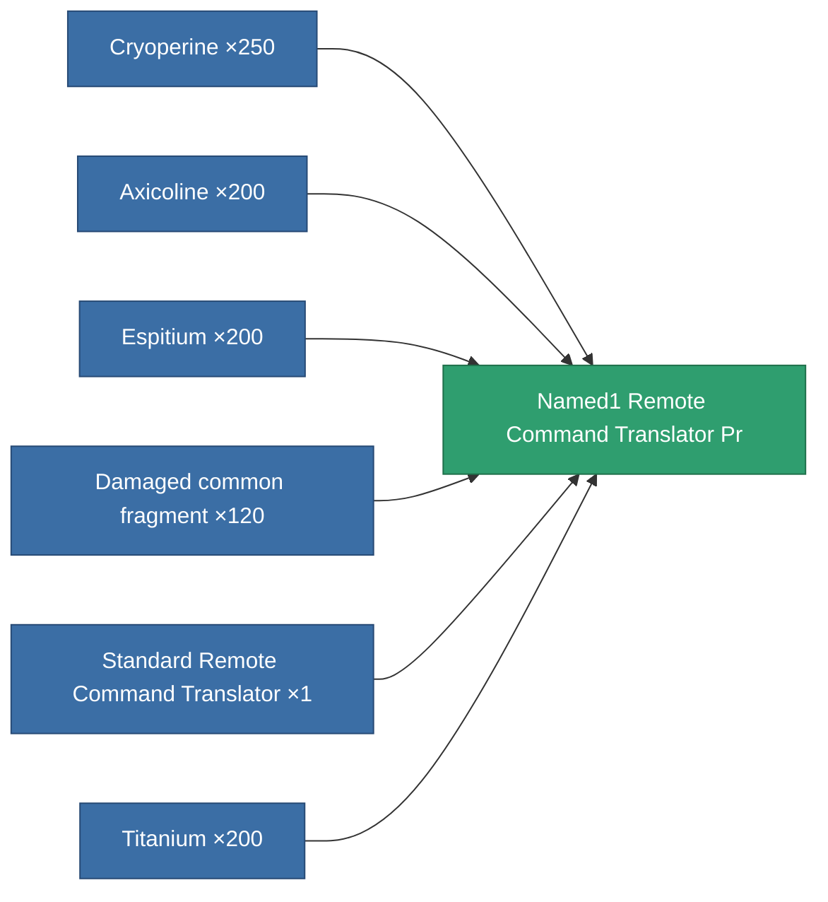

<!-- Generated by tools/generate from the live database (source: entitydefaults definition 8834, aggregatevalues via aggregatefields).
     Do not edit by hand; regenerate instead. -->

# Named1 Remote Command Translator Pr

|  |  |
|---|---|
| Definition | `def_named1_remote_command_translator_pr` |
| Tier | 2 |
| Health | 100 |
| Volume | 2.5 |
| Mass | 1250 |
| Category | Modules / Remote control |

## Stats

| Field | Value |
|---|---|
| core_usage | 8 |
| cpu_usage | 107 |
| cycle_time | 9k |
| drone_remote_command_translation_armor_max_modifier | 1.05 |
| drone_remote_command_translation_damage_modifier | 1.025 |
| drone_remote_command_translation_harvesting_amount_modifier | 1.025 |
| drone_remote_command_translation_mining_amount_modifier | 1.025 |
| drone_remote_command_translation_remote_repair_amount_modifier | 1.025 |
| drone_remote_command_translation_retreat | 0.001 |
| powergrid_usage | 57 |
| remote_control_lifetime_modifier | 60k |
| remote_control_operational_range_modifier | 10 |

<!-- production:generated -->
## Production

**Produced from 6 components, research level 6** — assemble the components to build it (see [Recipes](/content/recipes/) for the full list):

[All items](/content/items/)
