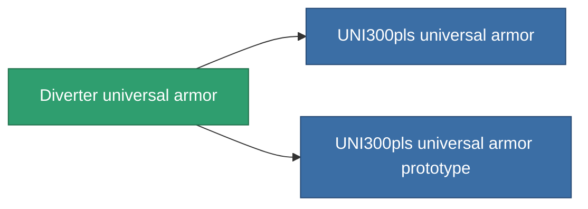

<!-- Generated by tools/generate from the live database (source: entitydefaults definition 954, aggregatevalues via aggregatefields).
     Do not edit by hand; regenerate instead. -->

# Diverter universal armor

|  |  |
|---|---|
| Definition | `def_named1_resistant_plating` |
| Tier | T2 |
| Health | 100 |
| Volume | 1.5 |
| Mass | 220 |
| Category | Modules / Enhancements |
| Tier line | [Standard universal armor](/content/items/standard-resistant-plating/) (T1) → **Diverter universal armor** (T2) → [UNI300pls universal armor](/content/items/named2-resistant-plating/) (T3) → [Aegis UAP-10XL universal armor](/content/items/named3-resistant-plating/) (T4) |

## Stats

| Field | Value |
|---|---|
| cpu_usage | 32 |
| powergrid_usage | 9 |
| resist_chemical | 30 |
| resist_explosive | 30 |
| resist_kinetic | 30 |
| resist_thermal | 30 |

<!-- production:generated -->
## Production

**Produced from 10 components, research level 4** — assemble the components to build it (see [Recipes](/content/recipes/) for the full list):

<svg class="prod-card-icon" aria-hidden="true"><use href="#mi-grid"/></svg><a class="prod-card-name" href="/content/items/axicol/">Cryoperine</a>

required: <b>50</b>

<svg class="prod-card-icon" aria-hidden="true"><use href="#mi-grid"/></svg><a class="prod-card-name" href="/content/items/isopropentol/">Isopropentol</a>

required: <b>50</b>

<svg class="prod-card-icon" aria-hidden="true"><use href="#mi-grid"/></svg><a class="prod-card-name" href="/content/items/metachropin/">Metachropin</a>

required: <b>150</b>

<svg class="prod-card-icon" aria-hidden="true"><use href="#mi-grid"/></svg><a class="prod-card-name" href="/content/items/plasteosine/">Plasteosine</a>

required: <b>150</b>

<svg class="prod-card-icon" aria-hidden="true"><use href="#mi-grid"/></svg><a class="prod-card-name" href="/content/items/prilumium/">Prilumium</a>

required: <b>50</b>

<svg class="prod-card-icon" aria-hidden="true"><use href="#mi-crystal"/></svg><a class="prod-card-name" href="/content/items/robotshard-common-basic/">Damaged common fragment</a>

required: <b>15</b>

<svg class="prod-card-icon" aria-hidden="true"><use href="#mi-crystal"/></svg><a class="prod-card-name" href="/content/items/robotshard-thelodica-basic/">Damaged thelodica fragment</a>

required: <b>15</b>

<svg class="prod-card-icon" aria-hidden="true"><use href="#mi-tree"/></svg><a class="prod-card-name" href="/content/items/standard-resistant-plating/">Standard universal armor</a>

required: <b>1</b>

<svg class="prod-card-icon" aria-hidden="true"><use href="#mi-grid"/></svg><a class="prod-card-name" href="/content/items/statichnol/">Statichnol</a>

required: <b>50</b>

<svg class="prod-card-icon" aria-hidden="true"><use href="#mi-grid"/></svg><a class="prod-card-name" href="/content/items/titanium/">Titanium</a>

required: <b>100</b>

## Used in production

**Component of 2 items** — everything that uses it in production:

