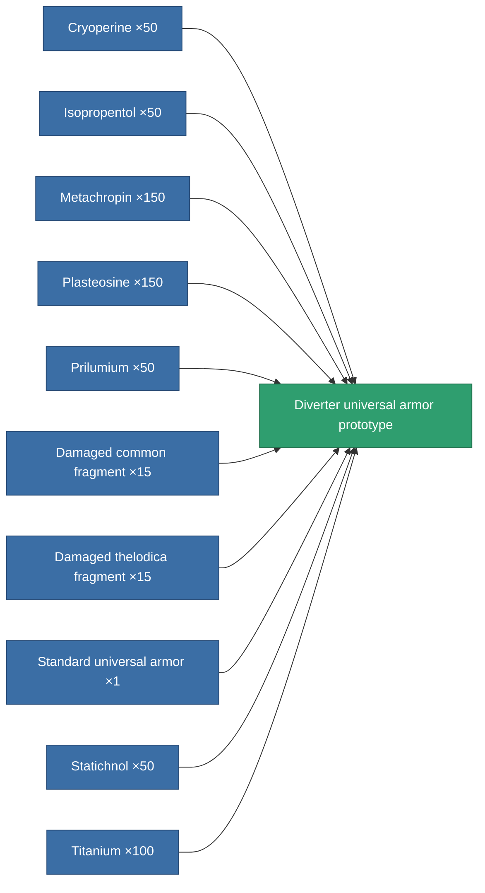

<!-- Generated by tools/generate from the live database (source: entitydefaults definition 2333, aggregatevalues via aggregatefields).
     Do not edit by hand; regenerate instead. -->

# Diverter universal armor prototype

|  |  |
|---|---|
| Definition | `def_named1_resistant_plating_pr` |
| Tier | 2 |
| Health | 100 |
| Volume | 1.5 |
| Mass | 165 |
| Category | Modules / Enhancements |

## Stats

| Field | Value |
|---|---|
| cpu_usage | 30 |
| powergrid_usage | 9 |
| resist_chemical | 31 |
| resist_explosive | 31 |
| resist_kinetic | 31 |
| resist_thermal | 31 |

<!-- production:generated -->
## Production

**Produced from 10 components, research level 4** — assemble the components to build it (see [Recipes](/content/recipes/) for the full list):

[All items](/content/items/)
