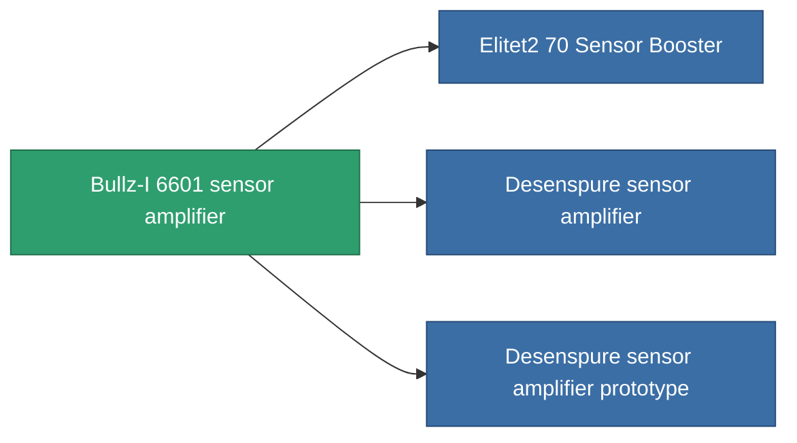

<!-- Generated by tools/generate from the live database (source: entitydefaults definition 768, aggregatevalues via aggregatefields).
     Do not edit by hand; regenerate instead. -->

# Bullz-I 6601 sensor amplifier

|  |  |
|---|---|
| Definition | `def_named1_sensor_booster` |
| Tier | 2 |
| Health | 100 |
| Volume | 0.5 |
| Mass | 80 |
| Category | Modules / Sensors & scanning |

## Stats

| Field | Value |
|---|---|
| core_usage | 9 |
| cpu_usage | 13 |
| cycle_time | 10k |
| effect_sensor_booster_locking_range_modifier | 1.35 |
| effect_sensor_booster_locking_time_modifier | 0.8 |
| powergrid_usage | 5 |

<!-- production:generated -->
## Production

**Component of 3 items** — everything that uses it in production:

[All items](/content/items/)
