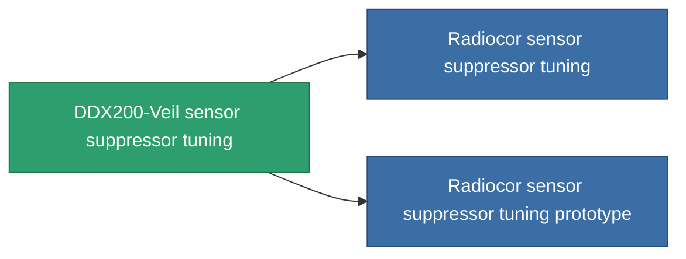

<!-- Generated by tools/generate from the live database (source: entitydefaults definition 4590, aggregatevalues via aggregatefields).
     Do not edit by hand; regenerate instead. -->

# DDX200-Veil sensor suppressor tuning

|  |  |
|---|---|
| Definition | `def_named1_sensor_supressor_booster` |
| Tier | 2 |
| Health | 100 |
| Volume | 0.5 |
| Mass | 135 |
| Category | Modules / Sensors & scanning |

## Stats

| Field | Value |
|---|---|
| core_usage_sensor_dampener_modifier | 1.1 |
| cpu_usage | 50 |
| effect_enhancer_sensor_dampener_locking_range_modifier | 0.95 |
| effect_enhancer_sensor_dampener_locking_time_modifier | 1.15 |
| powergrid_usage | 18 |

<!-- production:generated -->
## Production

**Component of 2 items** — everything that uses it in production:

[All items](/content/items/)
