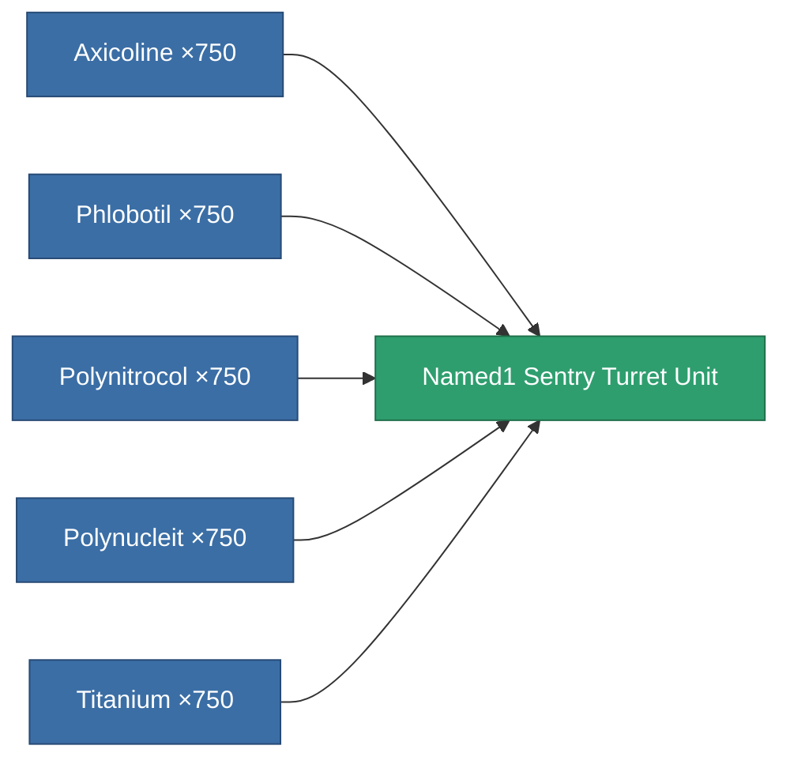

<!-- Generated by tools/generate from the live database (source: entitydefaults definition 8341, aggregatevalues via aggregatefields).
     Do not edit by hand; regenerate instead. -->

# Named1 Sentry Turret Unit

|  |  |
|---|---|
| Definition | `def_named1_sentry_turret_unit` |
| Tier | 2 |
| Health | 100 |
| Volume | 10 |
| Mass | 1 |
| Category | Special & other / Miscellaneous |

## Stats

| Field | Value |
|---|---|
| accuracy | 4.2 |
| armor_max | 2k |
| cycle_time | 1.79k |
| damage_chemical | 19.866 |
| damage_explosive | 39.732 |
| damage_kinetic | 39.732 |
| damage_thermal | 39.732 |
| damage_toxic | 19.866 |
| falloff | 15 |
| optimal_range | 10 |
| remote_control_bandwidth_usage | 3 |
| remote_control_lifetime | 300k |
| resist_chemical | 90 |
| resist_explosive | 90 |
| resist_kinetic | 90 |
| resist_thermal | 90 |

<!-- production:generated -->
## Production

**Produced from 5 components, research level 3** — assemble the components to build it (see [Recipes](/content/recipes/) for the full list):

[All items](/content/items/)
