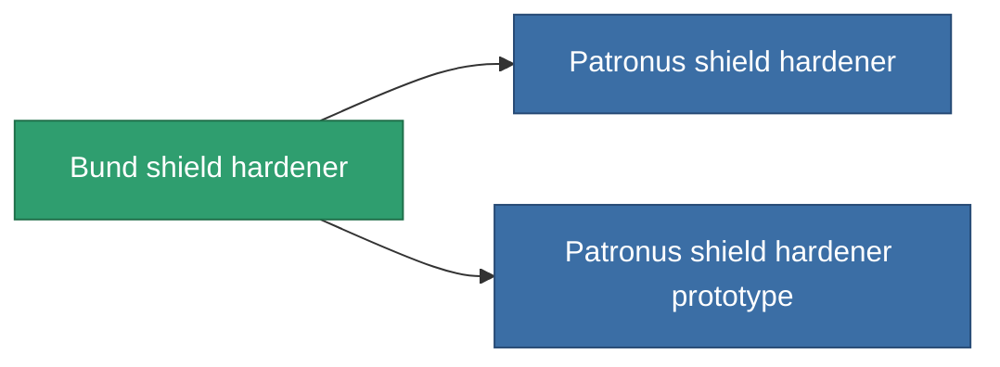

<!-- Generated by tools/generate from the live database (source: entitydefaults definition 732, aggregatevalues via aggregatefields).
     Do not edit by hand; regenerate instead. -->

# Bund shield hardener

|  |  |
|---|---|
| Definition | `def_named1_shield_hardener` |
| Tier | T2 |
| Health | 100 |
| Volume | 0.5 |
| Mass | 270 |
| Category | Modules / Shield |
| Tier line | [Standard shield hardener](/content/items/standard-shield-hardener/) (T1) → **Bund shield hardener** (T2) → [Patronus shield hardener](/content/items/named2-shield-hardener/) (T3) → [Guardian shield hardener](/content/items/named3-shield-hardener/) (T4) |
| Note | ettol a modultol tud jobban mudkodni a pajzs = kevesebb lesz a core csokkenes  |

## Stats

| Field | Value |
|---|---|
| cpu_usage | 48 |
| powergrid_usage | 18 |
| shield_absorbtion_modifier | 1.2 |

<!-- production:generated -->
## Production

**Produced from 8 components, research level 4** — assemble the components to build it (see [Recipes](/content/recipes/) for the full list):

<svg class="prod-card-icon" aria-hidden="true"><use href="#mi-grid"/></svg><a class="prod-card-name" href="/content/items/axicol/">Cryoperine</a>

required: <b>200</b>

<svg class="prod-card-icon" aria-hidden="true"><use href="#mi-grid"/></svg><a class="prod-card-name" href="/content/items/isopropentol/">Isopropentol</a>

required: <b>150</b>

<svg class="prod-card-icon" aria-hidden="true"><use href="#mi-grid"/></svg><a class="prod-card-name" href="/content/items/plasteosine/">Plasteosine</a>

required: <b>150</b>

<svg class="prod-card-icon" aria-hidden="true"><use href="#mi-crystal"/></svg><a class="prod-card-name" href="/content/items/robotshard-common-basic/">Damaged common fragment</a>

required: <b>15</b>

<svg class="prod-card-icon" aria-hidden="true"><use href="#mi-crystal"/></svg><a class="prod-card-name" href="/content/items/robotshard-pelistal-basic/">Damaged pelistal fragment</a>

required: <b>15</b>

<svg class="prod-card-icon" aria-hidden="true"><use href="#mi-tree"/></svg><a class="prod-card-name" href="/content/items/standard-shield-hardener/">Standard shield hardener</a>

required: <b>1</b>

<svg class="prod-card-icon" aria-hidden="true"><use href="#mi-grid"/></svg><a class="prod-card-name" href="/content/items/titanium/">Titanium</a>

required: <b>50</b>

<svg class="prod-card-icon" aria-hidden="true"><use href="#mi-grid"/></svg><a class="prod-card-name" href="/content/items/vitricyl/">Vitricyl</a>

required: <b>200</b>

## Used in production

**Component of 2 items** — everything that uses it in production:

