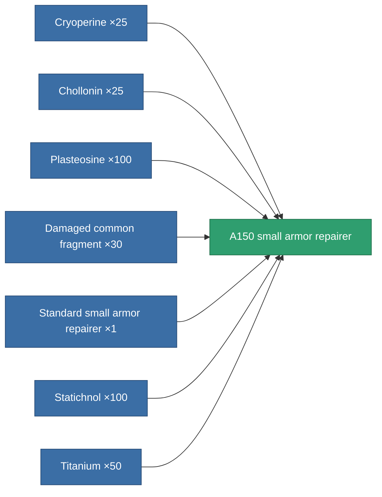
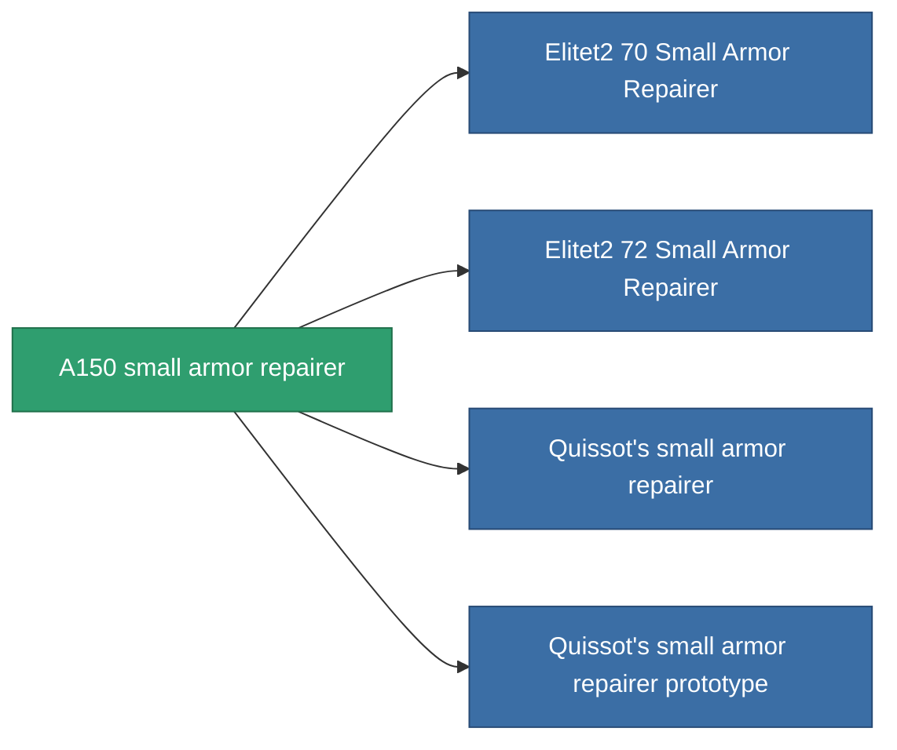

<!-- Generated by tools/generate from the live database (source: entitydefaults definition 693, aggregatevalues via aggregatefields).
     Do not edit by hand; regenerate instead. -->

# A150 small armor repairer

|  |  |
|---|---|
| Definition | `def_named1_small_armor_repairer` |
| Tier | T2 |
| Health | 100 |
| Volume | 1 |
| Mass | 225 |
| Category | Modules / Repair |
| Tier line | [Standard small armor repairer](/content/items/standard-small-armor-repairer/) (T1) → **A150 small armor repairer** (T2) → [Quissot's small armor repairer](/content/items/named2-small-armor-repairer/) (T3) → [Microforge Aestolar small armor repairer](/content/items/named3-small-armor-repairer/) (T4) |
| Note | armor_hp += repair_amount * armor_repair_amount_modifier  rof = cycle_time * armor_repair_cycle_time_modifier   |

## Stats

| Field | Value |
|---|---|
| armor_repair_amount | 60 |
| core_usage | 60 |
| cpu_usage | 30 |
| cycle_time | 15k |
| powergrid_usage | 18 |

<!-- production:generated -->
## Production

**Produced from 7 components, research level 3** — assemble the components to build it (see [Recipes](/content/recipes/) for the full list):

## Used in production

**Component of 4 items** — everything that uses it in production:

[All items](/content/items/)
