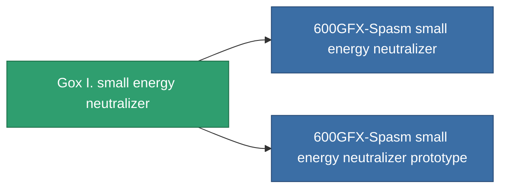

<!-- Generated by tools/generate from the live database (source: entitydefaults definition 753, aggregatevalues via aggregatefields).
     Do not edit by hand; regenerate instead. -->

# Gox I. small energy neutralizer

|  |  |
|---|---|
| Definition | `def_named1_small_energy_neutralizer` |
| Tier | 2 |
| Health | 100 |
| Volume | 0.5 |
| Mass | 90 |
| Category | Modules / Shield |
| Note | range = optimal_range *  energy_transferers_optimal_range_modifier    cel core -= energy_neutralized_amount  sajat core -= energy_neutralized_amount - 10% |

## Stats

| Field | Value |
|---|---|
| core_usage | 43 |
| cpu_usage | 23 |
| cycle_time | 8k |
| energy_dispersion | 4 |
| energy_neutralized_amount | 50 |
| falloff | 0 |
| optimal_range | 12.5 |
| powergrid_usage | 38 |

<!-- production:generated -->
## Production

**Component of 2 items** — everything that uses it in production:

[All items](/content/items/)
