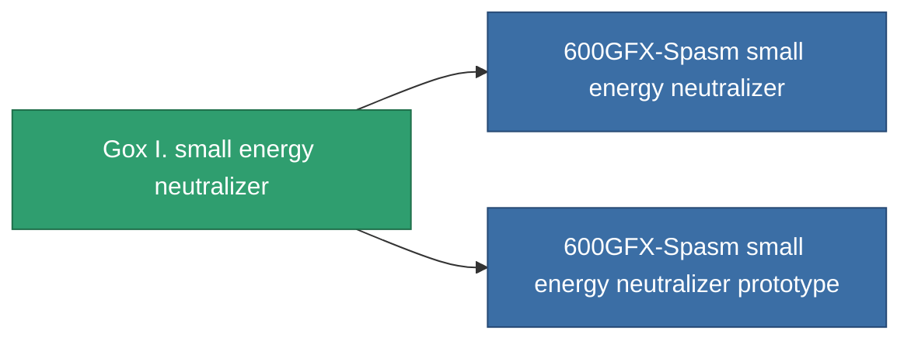

<!-- Generated by tools/generate from the live database (source: entitydefaults definition 753, aggregatevalues via aggregatefields).
     Do not edit by hand; regenerate instead. -->

# Gox I. small energy neutralizer

|  |  |
|---|---|
| Definition | `def_named1_small_energy_neutralizer` |
| Tier | T2 |
| Health | 100 |
| Volume | 0.5 |
| Mass | 90 |
| Category | Modules / Shield |
| Tier line | [Standard small energy neutralizer](/content/items/standard-small-energy-neutralizer/) (T1) → **Gox I. small energy neutralizer** (T2) → [600GFX-Spasm small energy neutralizer](/content/items/named2-small-energy-neutralizer/) (T3) → [Cerba small energy neutralizer](/content/items/named3-small-energy-neutralizer/) (T4) |
| Note | range = optimal_range *  energy_transferers_optimal_range_modifier    cel core -= energy_neutralized_amount  sajat core -= energy_neutralized_amount - 10% |

## Stats

| Field | Value |
|---|---|
| core_usage | 43 |
| cpu_usage | 23 |
| cycle_time | 8k |
| energy_dispersion | 4 |
| energy_neutralized_amount | 50 |
| falloff | 0 |
| optimal_range | 12.5 |
| powergrid_usage | 38 |

<!-- production:generated -->
## Production

**Produced from 8 components, research level 3** — assemble the components to build it (see [Recipes](/content/recipes/) for the full list):

<svg class="prod-card-icon" aria-hidden="true"><use href="#mi-grid"/></svg><a class="prod-card-name" href="/content/items/axicol/">Cryoperine</a>

required: <b>100</b>

<svg class="prod-card-icon" aria-hidden="true"><use href="#mi-grid"/></svg><a class="prod-card-name" href="/content/items/axicoline/">Axicoline</a>

required: <b>50</b>

<svg class="prod-card-icon" aria-hidden="true"><use href="#mi-grid"/></svg><a class="prod-card-name" href="/content/items/phlobotil/">Phlobotil</a>

required: <b>50</b>

<svg class="prod-card-icon" aria-hidden="true"><use href="#mi-crystal"/></svg><a class="prod-card-name" href="/content/items/robotshard-common-basic/">Damaged common fragment</a>

required: <b>15</b>

<svg class="prod-card-icon" aria-hidden="true"><use href="#mi-crystal"/></svg><a class="prod-card-name" href="/content/items/robotshard-pelistal-basic/">Damaged pelistal fragment</a>

required: <b>15</b>

<svg class="prod-card-icon" aria-hidden="true"><use href="#mi-grid"/></svg><a class="prod-card-name" href="/content/items/standard-small-energy-neutralizer/">Standard small energy neutralizer</a>

required: <b>1</b>

<svg class="prod-card-icon" aria-hidden="true"><use href="#mi-grid"/></svg><a class="prod-card-name" href="/content/items/titanium/">Titanium</a>

required: <b>50</b>

<svg class="prod-card-icon" aria-hidden="true"><use href="#mi-grid"/></svg><a class="prod-card-name" href="/content/items/vitricyl/">Vitricyl</a>

required: <b>100</b>

## Used in production

**Component of 2 items** — everything that uses it in production:

