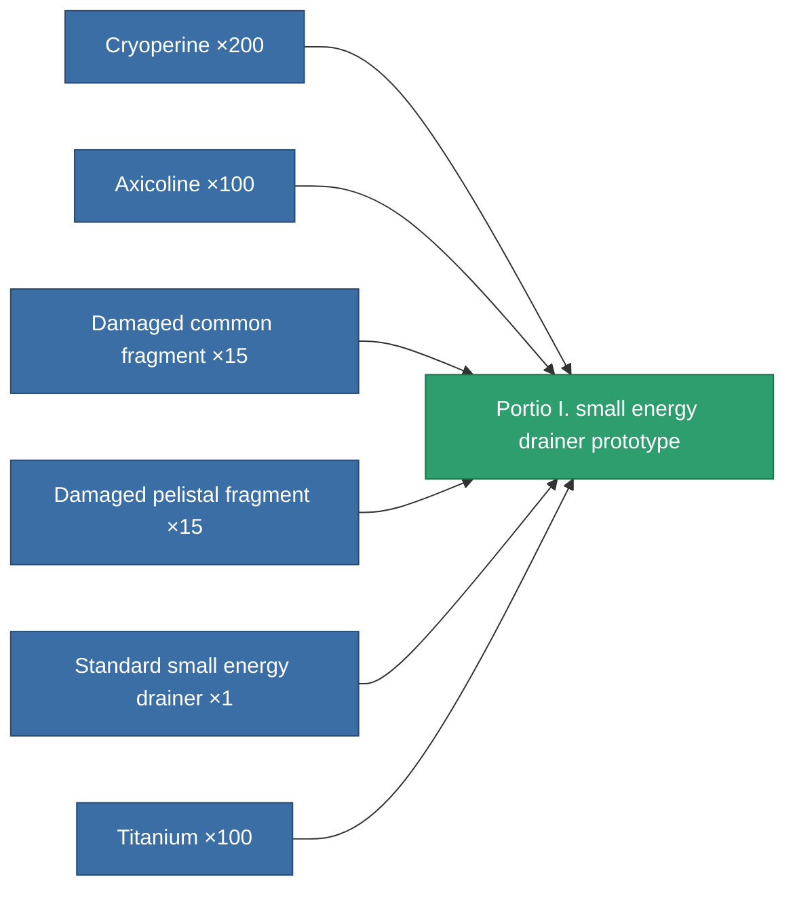

<!-- Generated by tools/generate from the live database (source: entitydefaults definition 2219, aggregatevalues via aggregatefields).
     Do not edit by hand; regenerate instead. -->

# Portio I. small energy drainer prototype

|  |  |
|---|---|
| Definition | `def_named1_small_energy_vampire_pr` |
| Tier | T2 (prototype) |
| Health | 100 |
| Volume | 0.5 |
| Mass | 70.5 |
| Category | Modules / Shield |
| Tier line | [Standard small energy drainer](/content/items/standard-small-energy-vampire/) (T1) → [Portio I. small energy drainer](/content/items/named1-small-energy-vampire/) (T2) → **Portio I. small energy drainer prototype** (T2) → [Ekcept small energy drainer](/content/items/named2-small-energy-vampire/) (T3) → [Io-trail SVU small energy drainer](/content/items/named3-small-energy-vampire/) (T4) |

## Stats

| Field | Value |
|---|---|
| core_usage | 5 |
| cpu_usage | 41 |
| cycle_time | 8k |
| energy_dispersion | 4 |
| energy_vampired_amount | 20 |
| falloff | 0 |
| optimal_range | 12.5 |
| powergrid_usage | 31 |

<!-- production:generated -->
## Production

**Produced from 6 components, research level 3** — assemble the components to build it (see [Recipes](/content/recipes/) for the full list):

[All items](/content/items/)
