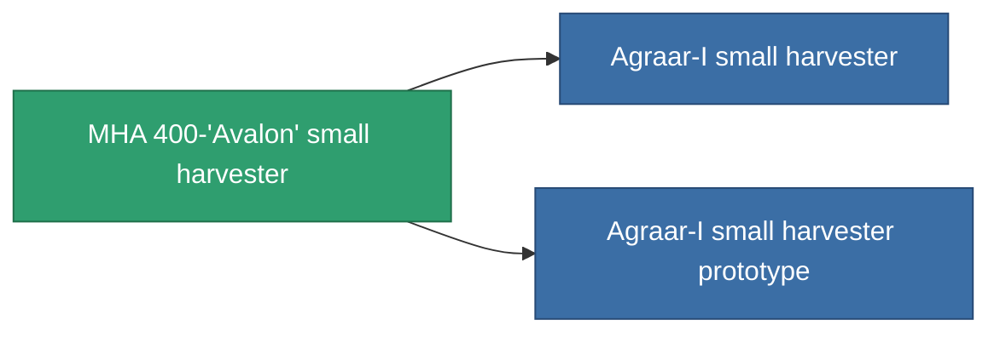

<!-- Generated by tools/generate from the live database (source: entitydefaults definition 807, aggregatevalues via aggregatefields).
     Do not edit by hand; regenerate instead. -->

# MHA 400-'Avalon' small harvester

|  |  |
|---|---|
| Definition | `def_named1_small_harvester` |
| Tier | 2 |
| Health | 100 |
| Volume | 1 |
| Mass | 360 |
| Category | Modules / Harvesting |

## Stats

| Field | Value |
|---|---|
| core_usage | 15 |
| cpu_usage | 38 |
| cycle_time | 15.5k |
| optimal_range | 3 |
| powergrid_usage | 28 |

<!-- production:generated -->
## Production

**Component of 2 items** — everything that uses it in production:

[All items](/content/items/)
