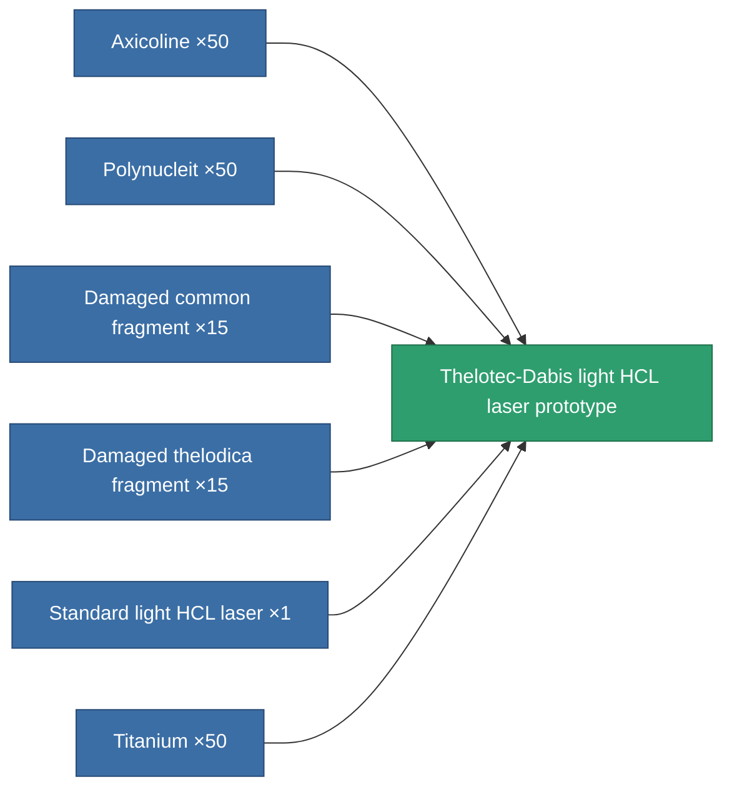

<!-- Generated by tools/generate from the live database (source: entitydefaults definition 2294, aggregatevalues via aggregatefields).
     Do not edit by hand; regenerate instead. -->

# Thelotec-Dabis light HCL laser prototype

|  |  |
|---|---|
| Definition | `def_named1_small_laser_pr` |
| Tier | 2 |
| Health | 100 |
| Volume | 0.5 |
| Mass | 225 |
| Category | Modules / Weapons |

## Stats

| Field | Value |
|---|---|
| accuracy | 4 |
| core_usage | 3.2 |
| cpu_usage | 17 |
| cycle_time | 4k |
| damage_modifier | 1 |
| falloff | 10 |
| least_optimal | 5 |
| optimal_range | 15 |
| powergrid_usage | 34 |

<!-- production:generated -->
## Production

**Produced from 6 components, research level 3** — assemble the components to build it (see [Recipes](/content/recipes/) for the full list):

[All items](/content/items/)
