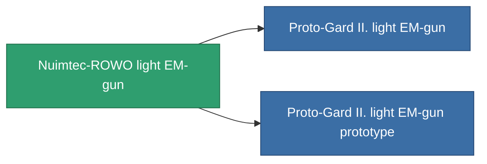

<!-- Generated by tools/generate from the live database (source: entitydefaults definition 858, aggregatevalues via aggregatefields).
     Do not edit by hand; regenerate instead. -->

# Nuimtec-ROWO light EM-gun

|  |  |
|---|---|
| Definition | `def_named1_small_railgun` |
| Tier | 2 |
| Health | 100 |
| Volume | 0.5 |
| Mass | 225 |
| Category | Modules / Weapons |

## Stats

| Field | Value |
|---|---|
| accuracy | 5 |
| core_usage | 3 |
| cpu_usage | 23 |
| cycle_time | 5k |
| damage_modifier | 1.35 |
| falloff | 5 |
| least_optimal | 8 |
| optimal_range | 12 |
| powergrid_usage | 26 |

<!-- production:generated -->
## Production

**Component of 2 items** — everything that uses it in production:

[All items](/content/items/)
