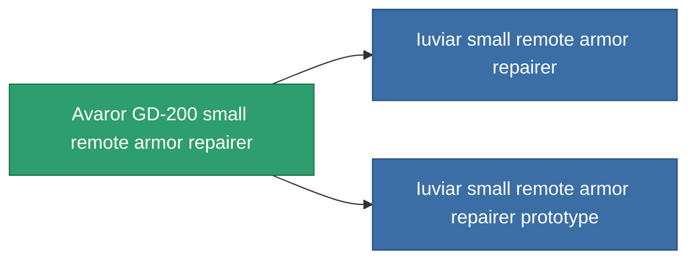

<!-- Generated by tools/generate from the live database (source: entitydefaults definition 702, aggregatevalues via aggregatefields).
     Do not edit by hand; regenerate instead. -->

# Avaror GD-200 small remote armor repairer

|  |  |
|---|---|
| Definition | `def_named1_small_remote_armor_repairer` |
| Tier | T2 |
| Health | 100 |
| Volume | 1 |
| Mass | 225 |
| Category | Modules / Repair |
| Tier line | [Standard small remote armor repairer](/content/items/standard-small-remote-armor-repairer/) (T1) → **Avaror GD-200 small remote armor repairer** (T2) → [Iuviar small remote armor repairer](/content/items/named2-small-remote-armor-repairer/) (T3) → [PPDT-Apadisiator small remote armor repairer](/content/items/named3-small-remote-armor-repairer/) (T4) |
| Note | armor_hp += repair_amount * armor_repair_amount_modifier  rof = cycle_time * armor_repair_cycle_time_modifier    pont ugy mint az armor repair systemnel. -> sajat magamat is jobban gyogyitom, es remote armor systemmel is jobb vagyok.    range = optimal_range * armor_repair_optimal_range_modifier   |

## Stats

| Field | Value |
|---|---|
| armor_repair_amount | 60 |
| core_usage | 68 |
| cpu_usage | 42 |
| cycle_time | 20k |
| falloff | 0 |
| optimal_range | 10 |
| powergrid_usage | 22 |

<!-- production:generated -->
## Production

**Produced from 5 components, research level 3** — assemble the components to build it (see [Recipes](/content/recipes/) for the full list):

<svg class="prod-card-icon" aria-hidden="true"><use href="#mi-grid"/></svg><a class="prod-card-name" href="/content/items/axicol/">Cryoperine</a>

required: <b>50</b>

<svg class="prod-card-icon" aria-hidden="true"><use href="#mi-grid"/></svg><a class="prod-card-name" href="/content/items/plasteosine/">Plasteosine</a>

required: <b>250</b>

<svg class="prod-card-icon" aria-hidden="true"><use href="#mi-crystal"/></svg><a class="prod-card-name" href="/content/items/robotshard-common-basic/">Damaged common fragment</a>

required: <b>30</b>

<svg class="prod-card-icon" aria-hidden="true"><use href="#mi-tree"/></svg><a class="prod-card-name" href="/content/items/standard-small-remote-armor-repairer/">Standard small remote armor repairer</a>

required: <b>1</b>

<svg class="prod-card-icon" aria-hidden="true"><use href="#mi-grid"/></svg><a class="prod-card-name" href="/content/items/titanium/">Titanium</a>

required: <b>100</b>

## Used in production

**Component of 2 items** — everything that uses it in production:

