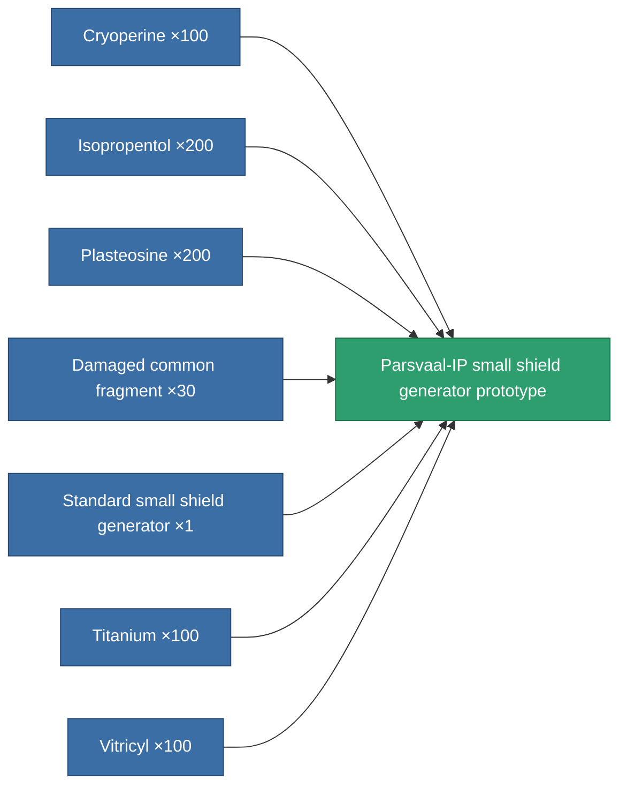

<!-- Generated by tools/generate from the live database (source: entitydefaults definition 2204, aggregatevalues via aggregatefields).
     Do not edit by hand; regenerate instead. -->

# Parsvaal-IP small shield generator prototype

|  |  |
|---|---|
| Definition | `def_named1_small_shield_generator_pr` |
| Tier | 2 |
| Health | 100 |
| Volume | 0.3 |
| Mass | 135 |
| Category | Modules / Shield |

## Stats

| Field | Value |
|---|---|
| core_usage | 1 |
| cpu_usage | 38 |
| cycle_time | 2.5k |
| powergrid_usage | 43 |
| shield_absorbtion | 2 |
| shield_radius | 4.5 |

<!-- production:generated -->
## Production

**Produced from 7 components, research level 3** — assemble the components to build it (see [Recipes](/content/recipes/) for the full list):

[All items](/content/items/)
