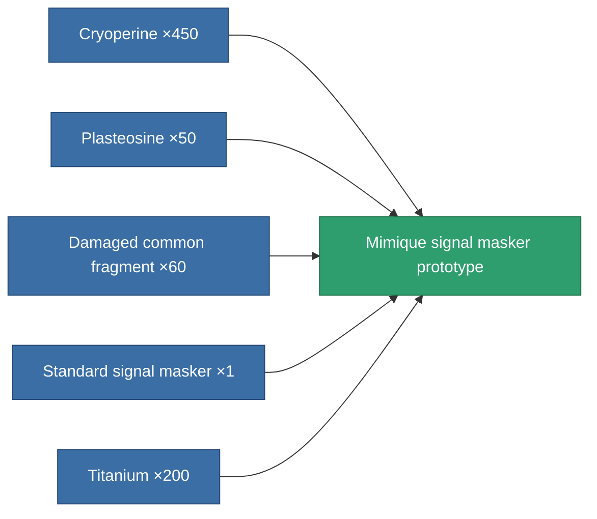

<!-- Generated by tools/generate from the live database (source: entitydefaults definition 2926, aggregatevalues via aggregatefields).
     Do not edit by hand; regenerate instead. -->

# Mimique signal masker prototype

|  |  |
|---|---|
| Definition | `def_named1_stealth_modul_pr` |
| Tier | T2 (prototype) |
| Health | 100 |
| Volume | 0.5 |
| Mass | 187.5 |
| Category | Modules / Enhancements |
| Tier line | [Standard signal masker](/content/items/standard-stealth-modul/) (T1) → [Mimique signal masker](/content/items/named1-stealth-modul/) (T2) → **Mimique signal masker prototype** (T2) → [MSMD signal masker](/content/items/named2-stealth-modul/) (T3) → [Longlag signal masker](/content/items/named3-stealth-modul/) (T4) |

## Stats

| Field | Value |
|---|---|
| core_usage | 1.5 |
| cpu_usage | 85 |
| cycle_time | 10k |
| effect_stealth_strength_modifier | 35 |
| powergrid_usage | 5 |

<!-- production:generated -->
## Production

**Produced from 5 components, research level 7** — assemble the components to build it (see [Recipes](/content/recipes/) for the full list):

[All items](/content/items/)
