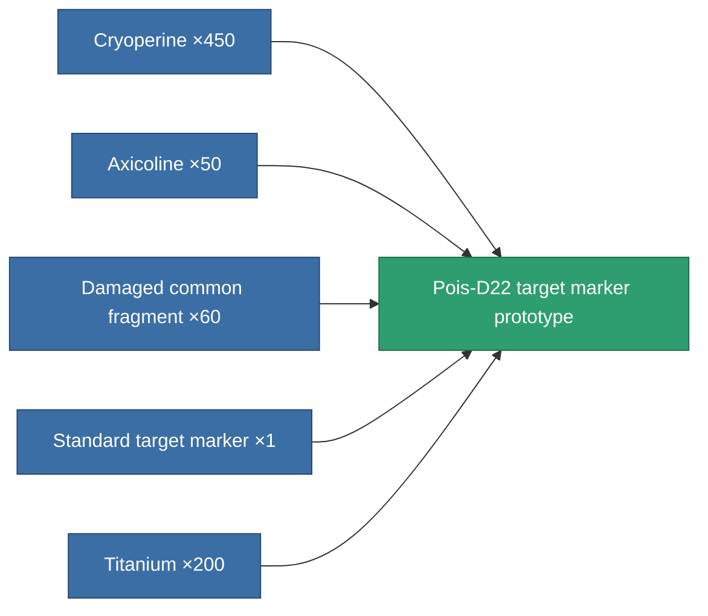

<!-- Generated by tools/generate from the live database (source: entitydefaults definition 2929, aggregatevalues via aggregatefields).
     Do not edit by hand; regenerate instead. -->

# Pois-D22 target marker prototype

|  |  |
|---|---|
| Definition | `def_named1_target_painter_pr` |
| Tier | T2 (prototype) |
| Health | 100 |
| Volume | 0.5 |
| Mass | 375 |
| Category | Modules / Enhancements |
| Tier line | [Standard target marker](/content/items/standard-target-painter/) (T1) → [Pois-D22 target marker](/content/items/named1-target-painter/) (T2) → **Pois-D22 target marker prototype** (T2) → [Colqual target marker](/content/items/named2-target-painter/) (T3) → [Pulsus target marker](/content/items/named3-target-painter/) (T4) |

## Stats

| Field | Value |
|---|---|
| core_usage | 100 |
| cpu_usage | 45 |
| cycle_time | 10k |
| effect_stealth_strength_modifier | -70 |
| optimal_range | 75 |
| powergrid_usage | 20 |

<!-- production:generated -->
## Production

**Produced from 5 components, research level 5** — assemble the components to build it (see [Recipes](/content/recipes/) for the full list):

[All items](/content/items/)
