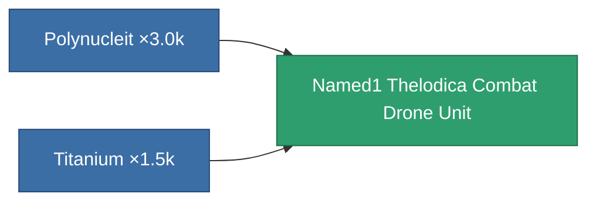

<!-- Generated by tools/generate from the live database (source: entitydefaults definition 8414, aggregatevalues via aggregatefields).
     Do not edit by hand; regenerate instead. -->

# Named1 Thelodica Combat Drone Unit

|  |  |
|---|---|
| Definition | `def_named1_thelodica_combat_drone_unit` |
| Tier | 2 |
| Health | 100 |
| Volume | 20 |
| Mass | 1 |
| Category | Special & other / Miscellaneous |

## Stats

| Field | Value |
|---|---|
| accuracy | 8.05 |
| armor_max | 1.938k |
| cycle_time | 3.125k |
| damage_thermal | 56.8464 |
| remote_control_bandwidth_usage | 5 |
| remote_control_lifetime | 300k |
| resist_chemical | 30 |
| resist_explosive | 10 |
| resist_kinetic | 150 |
| resist_thermal | 45 |
| signature_radius | 4.75 |

<!-- production:generated -->
## Production

**Produced from 2 components, research level 4** — assemble the components to build it (see [Recipes](/content/recipes/) for the full list):

[All items](/content/items/)
