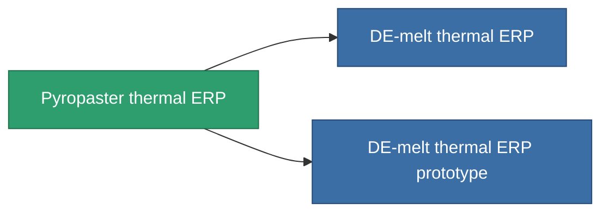

<!-- Generated by tools/generate from the live database (source: entitydefaults definition 3298, aggregatevalues via aggregatefields).
     Do not edit by hand; regenerate instead. -->

# Pyropaster thermal ERP

|  |  |
|---|---|
| Definition | `def_named1_thermal_kers` |
| Tier | T2 |
| Health | 100 |
| Volume | 1 |
| Mass | 450 |
| Category | Modules / Enhancements |
| Tier line | [Standard thermal ERP](/content/items/standard-thermal-kers/) (T1) → **Pyropaster thermal ERP** (T2) → [DE-melt thermal ERP](/content/items/named2-thermal-kers/) (T3) → [Dyoriva thermal ERP](/content/items/named3-thermal-kers/) (T4) |

## Stats

| Field | Value |
|---|---|
| chemical_damage_to_core_modifier | 0.2 |
| cpu_usage | 45 |
| explosive_damage_to_core_modifier | 0.1 |
| kinetic_damage_to_core_modifier | 0.1 |
| powergrid_usage | 10 |
| thermal_damage_to_core_modifier | 0.5 |

<!-- production:generated -->
## Production

**Produced from 8 components, research level 6** — assemble the components to build it (see [Recipes](/content/recipes/) for the full list):

<svg class="prod-card-icon" aria-hidden="true"><use href="#mi-grid"/></svg><a class="prod-card-name" href="/content/items/axicol/">Cryoperine</a>

required: <b>200</b>

<svg class="prod-card-icon" aria-hidden="true"><use href="#mi-grid"/></svg><a class="prod-card-name" href="/content/items/isopropentol/">Isopropentol</a>

required: <b>100</b>

<svg class="prod-card-icon" aria-hidden="true"><use href="#mi-grid"/></svg><a class="prod-card-name" href="/content/items/plasteosine/">Plasteosine</a>

required: <b>100</b>

<svg class="prod-card-icon" aria-hidden="true"><use href="#mi-crystal"/></svg><a class="prod-card-name" href="/content/items/robotshard-common-basic/">Damaged common fragment</a>

required: <b>2</b>

<svg class="prod-card-icon" aria-hidden="true"><use href="#mi-crystal"/></svg><a class="prod-card-name" href="/content/items/robotshard-pelistal-basic/">Damaged pelistal fragment</a>

required: <b>2</b>

<svg class="prod-card-icon" aria-hidden="true"><use href="#mi-grid"/></svg><a class="prod-card-name" href="/content/items/standard-thermal-kers/">Standard thermal ERP</a>

required: <b>1</b>

<svg class="prod-card-icon" aria-hidden="true"><use href="#mi-grid"/></svg><a class="prod-card-name" href="/content/items/titanium/">Titanium</a>

required: <b>200</b>

<svg class="prod-card-icon" aria-hidden="true"><use href="#mi-grid"/></svg><a class="prod-card-name" href="/content/items/vitricyl/">Vitricyl</a>

required: <b>200</b>

## Used in production

**Component of 2 items** — everything that uses it in production:

