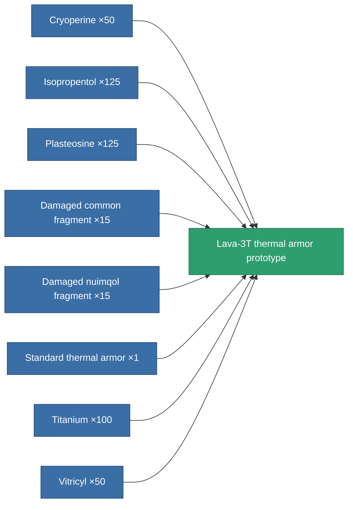

<!-- Generated by tools/generate from the live database (source: entitydefaults definition 2192, aggregatevalues via aggregatefields).
     Do not edit by hand; regenerate instead. -->

# Lava-3T thermal armor prototype

|  |  |
|---|---|
| Definition | `def_named1_thrm_armor_hardener_pr` |
| Tier | T2 (prototype) |
| Health | 100 |
| Volume | 1 |
| Mass | 67.5 |
| Category | Modules / Armor |
| Tier line | [Standard thermal armor](/content/items/standard-thrm-armor-hardener/) (T1) → [Lava-3T thermal armor](/content/items/named1-thrm-armor-hardener/) (T2) → **Lava-3T thermal armor prototype** (T2) → [Thermoflake thermal armor](/content/items/named2-thrm-armor-hardener/) (T3) → [Hephaistos-TSS thermal armor](/content/items/named3-thrm-armor-hardener/) (T4) |

## Stats

| Field | Value |
|---|---|
| core_usage | 9 |
| cpu_usage | 21 |
| cycle_time | 10k |
| effect_resist_thermal | 100 |
| powergrid_usage | 4 |
| resist_thermal | 25 |

<!-- production:generated -->
## Production

**Produced from 8 components, research level 4** — assemble the components to build it (see [Recipes](/content/recipes/) for the full list):

[All items](/content/items/)
