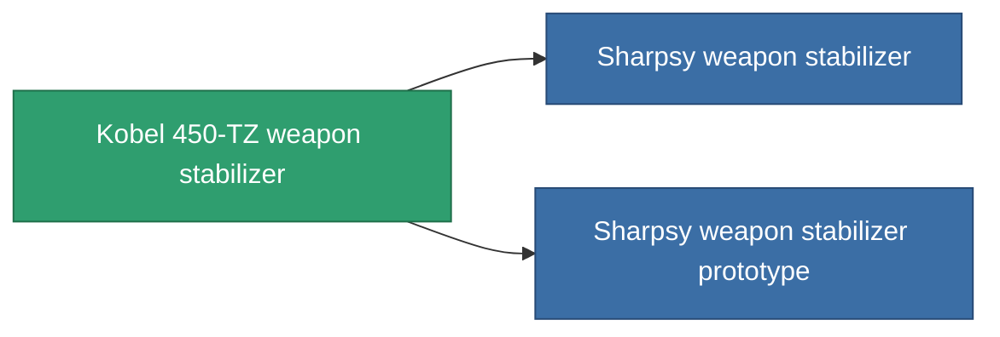

<!-- Generated by tools/generate from the live database (source: entitydefaults definition 3382, aggregatevalues via aggregatefields).
     Do not edit by hand; regenerate instead. -->

# Kobel 450-TZ weapon stabilizer

|  |  |
|---|---|
| Definition | `def_named1_weapon_stabilizer` |
| Tier | T2 |
| Health | 100 |
| Volume | 1 |
| Mass | 450 |
| Category | Modules / Weapons |
| Tier line | [Standard weapon stabilizer](/content/items/standard-weapon-stabilizer/) (T1) → **Kobel 450-TZ weapon stabilizer** (T2) → [Sharpsy weapon stabilizer](/content/items/named2-weapon-stabilizer/) (T3) → [Kobel 300-XZ weapon stabilizer](/content/items/named3-weapon-stabilizer/) (T4) |

## Stats

| Field | Value |
|---|---|
| accuracy_modifier | 0.9 |
| cpu_usage | 32 |
| explosion_radius_modifier | 0.9 |
| massiveness | -0.05 |
| powergrid_usage | 18 |

<!-- production:generated -->
## Production

**Produced from 5 components, research level 5** — assemble the components to build it (see [Recipes](/content/recipes/) for the full list):

<svg class="prod-card-icon" aria-hidden="true"><use href="#mi-grid"/></svg><a class="prod-card-name" href="/content/items/axicol/">Cryoperine</a>

required: <b>350</b>

<svg class="prod-card-icon" aria-hidden="true"><use href="#mi-grid"/></svg><a class="prod-card-name" href="/content/items/axicoline/">Axicoline</a>

required: <b>150</b>

<svg class="prod-card-icon" aria-hidden="true"><use href="#mi-crystal"/></svg><a class="prod-card-name" href="/content/items/robotshard-common-basic/">Damaged common fragment</a>

required: <b>30</b>

<svg class="prod-card-icon" aria-hidden="true"><use href="#mi-robots"/></svg><a class="prod-card-name" href="/content/items/standard-weapon-stabilizer/">Standard weapon stabilizer</a>

required: <b>1</b>

<svg class="prod-card-icon" aria-hidden="true"><use href="#mi-grid"/></svg><a class="prod-card-name" href="/content/items/titanium/">Titanium</a>

required: <b>150</b>

## Used in production

**Component of 2 items** — everything that uses it in production:

