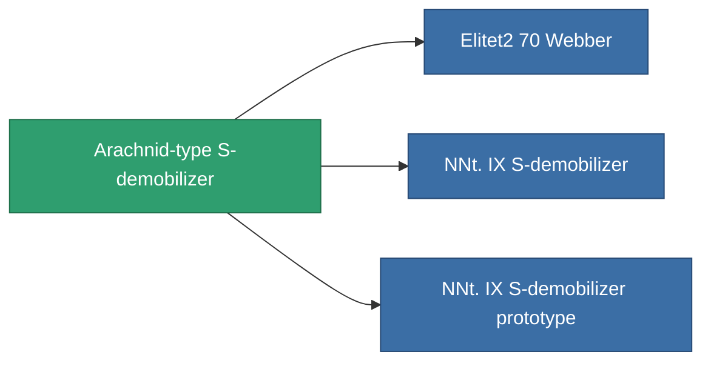

<!-- Generated by tools/generate from the live database (source: entitydefaults definition 786, aggregatevalues via aggregatefields).
     Do not edit by hand; regenerate instead. -->

# Arachnid-type S-demobilizer

|  |  |
|---|---|
| Definition | `def_named1_webber` |
| Tier | T2 |
| Health | 100 |
| Volume | 0.5 |
| Mass | 90 |
| Category | Modules / Enhancements |
| Tier line | [Standard S-demobilizer](/content/items/standard-webber/) (T1) → **Arachnid-type S-demobilizer** (T2) → [NNt. IX S-demobilizer](/content/items/named2-webber/) (T3) → [NNt. IY S-demobilizer](/content/items/named3-webber/) (T4) |

## Stats

| Field | Value |
|---|---|
| core_usage | 15 |
| cpu_usage | 41 |
| cycle_time | 5k |
| effect_massivness_speed_max_modifier | 0.65 |
| falloff | 0 |
| optimal_range | 12 |
| powergrid_usage | 14 |

<!-- production:generated -->
## Production

**Produced from 5 components, research level 4** — assemble the components to build it (see [Recipes](/content/recipes/) for the full list):

<svg class="prod-card-icon" aria-hidden="true"><use href="#mi-grid"/></svg><a class="prod-card-name" href="/content/items/axicol/">Cryoperine</a>

required: <b>350</b>

<svg class="prod-card-icon" aria-hidden="true"><use href="#mi-grid"/></svg><a class="prod-card-name" href="/content/items/axicoline/">Axicoline</a>

required: <b>100</b>

<svg class="prod-card-icon" aria-hidden="true"><use href="#mi-crystal"/></svg><a class="prod-card-name" href="/content/items/robotshard-common-basic/">Damaged common fragment</a>

required: <b>30</b>

<svg class="prod-card-icon" aria-hidden="true"><use href="#mi-grid"/></svg><a class="prod-card-name" href="/content/items/standard-webber/">Standard S-demobilizer</a>

required: <b>1</b>

<svg class="prod-card-icon" aria-hidden="true"><use href="#mi-grid"/></svg><a class="prod-card-name" href="/content/items/titanium/">Titanium</a>

required: <b>100</b>

## Used in production

**Component of 3 items** — everything that uses it in production:

