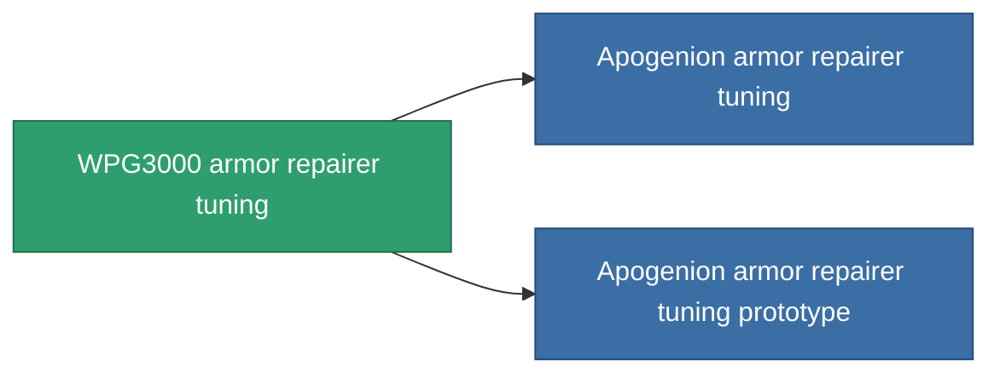

<!-- Generated by tools/generate from the live database (source: entitydefaults definition 1064, aggregatevalues via aggregatefields).
     Do not edit by hand; regenerate instead. -->

# WPG3000 armor repairer tuning

|  |  |
|---|---|
| Definition | `def_named2_armor_repairer_upgrade` |
| Tier | 3 |
| Health | 100 |
| Volume | 0.5 |
| Mass | 300 |
| Category | Modules / Repair |

## Stats

| Field | Value |
|---|---|
| armor_repair_amount_modifier | 1.12 |
| armor_repair_cycle_time_modifier | 0.936 |
| cpu_usage | 37 |
| powergrid_usage | 27 |

<!-- production:generated -->
## Production

**Component of 2 items** — everything that uses it in production:

[All items](/content/items/)
